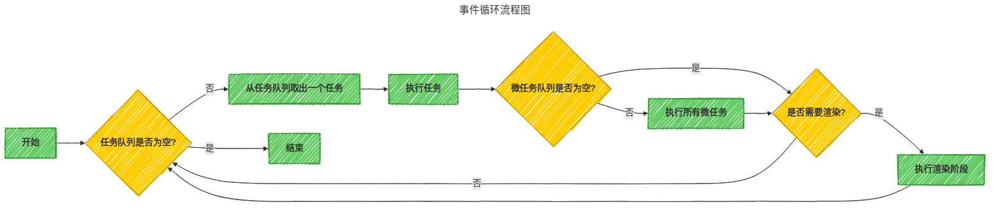

# 事件循环{#event-loop}

事件循环是浏览器渲染主线程的核心工作机制，它通过一个持续运行的循环实现 `取任务-执行任务-渲染` 的完整流程，是 JavaScript 单线程环境下实现异步的基础：

1. **核心流程**：主线程维护多个不同优先级的任务队列（社区常称为“宏任务队列”），每次循环从队列中取出一个任务执行；
2. **多线程协作**：其他线程（如网络线程、定时器线程等）只需在适当时候将任务添加到对应队列中；
3. **微任务优先机制**：每次执行完一个任务后，必须优先清空微任务队列（如 Promise 回调、MutationObserver、queueMicrotask 等）；
4. **渲染时机**：微任务队列清空后，根据需要进入渲染阶段，执行样式计算、布局、绘制等操作；
5. **现代浏览器机制**：采用灵活的多队列优先级设计，确保高优先级任务（如用户交互）能及时响应，同时避免主线程阻塞。

## 队列系统{#event-loop-queues}

浏览器的事件循环主要包含两种队列和一个渲染阶段：

:::tip 注意
在现代浏览器的 HTML 规范中，没有"宏任务队列"这个官方术语。"宏任务"是社区为了与"微任务"区分而创造的术语，规范中只定义了"任务队列"和"微任务队列"
:::

### 1. 任务队列（Task Queue）{#task-queue}

任务队列（社区常称为"宏任务队列"）存放各种任务，按照执行优先级分为：

- **事件队列**：存放用户交互任务，如点击事件、键盘事件、滚动事件等
- **延时队列**：存放定时器任务，由 `setTimeout` 和 `setInterval` 创建的回调任务
- **网络队列**：存放网络任务，如 `XMLHttpRequest`、`fetch` 完成后的回调任务
- **文件队列**：存放文件读写任务，如 `readFile`、`writeFile` 完成后的回调任务（Node.js 独有）

#### 执行规则{#task-queue-execution}

- 按照优先级顺序取不同队列的任务
- 每次事件循环只执行一个任务
- 执行完任务后会检查微任务队列

### 2. 微任务队列（Microtask Queue）{#microtask-queue}

存放优先级更高的任务：

- **Promise 回调**：`Promise.then/catch/finally`
- **显式微任务**：`queueMicrotask`
- **DOM 变化监听**：`MutationObserver`
- **Node.js 特有**：`process.nextTick`

#### 执行规则{#microtask-queue-execution}

- 微任务优先级高于普通任务
- 在每个任务执行后，会清空所有微任务

### 3. 渲染阶段（Rendering Phase）{#rendering-phase}

渲染阶段不是队列，而是事件循环中的一个特殊阶段：

- **渲染任务**：通过 `requestAnimationFrame` 触发的回调
- **渲染操作**：样式计算、布局、绘制等

#### 执行规则{#rendering-phase-execution}

- 在微任务队列清空后执行
- 受浏览器刷新率限制（通常每秒 60 次）
- 页面不可见时暂停执行

#### 执行时机{#rendering-phase-timing}

渲染任务（如 requestAnimationFrame 回调）不是普通任务，它们在事件循环的渲染阶段执行，通常在微任务队列清空后，且受浏览器刷新率限制。

:::tip 事件与任务的区别
事件是用户或系统产生的动作（如点击、定时器到期），而任务是响应这些事件而需要执行的代码回调。例如，点击按钮产生一个点击事件，浏览器随后将对应的回调函数作为一个任务添加到任务队列中等待执行。
:::

## 事件循环流程：{#event-loop-diagram}

事件循环的完整执行流程如下：

1. 检查任务队列是否为空
2. 如果不为空，从任务队列中取出一个任务执行
3. 执行完毕后，检查并清空微任务队列
4. 如果需要进行渲染，进入渲染阶段
5. 重复步骤 1



### 示例

```javascript codeRunTask
---
data: {
  config: {

  },
  runSteps: [
    {
      id: 1,
      type: "synchronous",
      task: "执行第一个console.log",
      taskName: "log('开始')",
      createTask: {},
      codeNumbers: [2],
      result: "这是第一个同步执行的代码，直接输出到控制台<br>输出结果: 开始",
      console: "开始",
      runTime: 2000,
      deleteCallStack: [1]
    },
    {
      id: 2,
      type: "synchronous",
      task: "注册setTimeout任务",
      taskName: "setTimeout(定时器任务, 0)",
      createTask: {
        type: "timer",
        taskId: 9,
      },
      codeNumbers: [6,7,8,9,10,11],
      result: "注册一个延时器，0秒后将回调函数放入任务队列<br>setTimeout是一个宏任务，会被放入延时队列<br>创建任务 `定时器任务` 到延时队列",
      console: "",
      runTime: 2000,
      deleteCallStack: [2]
    },
    {
      id: 3,
      type: "synchronous",
      task: "注册Promise微任务",
      taskName: "Promise",
      createTask: {
        type: "microtask",
        taskId: 7,
      },
      codeNumbers: [15,16,17],
      result: "Promise.resolve()创建一个已解决的Promise，then回调会被放入微任务队列<br>创建任务 `全局Promise` 到微队列",
      console: "",
      runTime: 2000,
      deleteCallStack: [3]
    },
    {
      id: 4,
      type: "synchronous",
      task: "注册queueMicrotask微任务",
      taskName: "queueMicrotask",
      createTask: {
        type: "microtask",
        taskId: 8,
      },
      codeNumbers: [19,20,21],
      result: "queueMicrotask()直接将回调函数放入微任务队列<br>创建任务 `queueMicrotask任务` 到微队列",
      console: "",
      runTime: 2000,
      deleteCallStack: [4]
    },
    {
      id: 5,
      type: "synchronous",
      task: "注册requestAnimationFrame渲染任务",
      taskName: "reqAniFrame",
      createTask: {
        type: "rendering",
        taskId: 11,
      },
      codeNumbers: [24,25,26],
      result: "requestAnimationFrame()将回调函数注册为渲染任务，会在下一次浏览器重绘之前执行<br>创建任务 `reqAniFrame回调` 到渲染任务列表",
      console: "",
      runTime: 2000,
      deleteCallStack: [5]
    },
    {
      id: 6,
      type: "synchronous",
      task: "执行第二个console.log",
      taskName: "log('结束')",
      createTask: {},
      codeNumbers: [28],
      result: "这是最后一个同步执行的代码，直接输出到控制台，执行完毕后，同步代码执行结束<br>输出结果: 结束",
      console: "结束",
      runTime: 2000,
      deleteCallStack: [6]
    },
    {
      id: 7,
      type: "microtask",
      task: "执行微任务：Promise任务",
      taskName: "Promise",
      createTask: {},
      codeNumbers: [12],
      result: "执行微任务队列中的 `Promise任务`<br>输出结果： 微任务：Promise",
      console: "微任务：Promise",
      runTime: 2000,
      deleteCallStack: [7]
    },
    {
      id: 8,
      type: "microtask",
      task: "执行微任务：queueMicrotask任务",
      taskName: "queueMicrotask任务",
      createTask: {},
      codeNumbers: [16],
      result: "执行微任务队列中的 `queueMicrotask任务`<br>输出结果： 微任务：queueMicrotask",
      console: "微任务：queueMicrotask",
      runTime: 2000,
      deleteCallStack: [8]
    },
    {
      id: 9,
      type: "timer",
      task: "执行延时任务：定时器中微任务",
      taskName: "定时器任务",
      createTask: {
        type: "microtask",
        taskId: 10,
      },
      codeNumbers: [6,9,10,11],
      result: "执行延时任务队列中的 `定时器任务`<br>输出结果： 定时器任务<br>在定时器任务中创建了一个Promise微任务<br>创建任务 `定时器中微任务` 到微队列",
      console: "定时器任务",
      runTime: 2000,
      deleteCallStack: [9]
    },
    {
      id: 10,
      type: "microtask",
      task: "执行微任务：定时器中微任务",
      taskName: "定时器中微任务",
      createTask: {},
      codeNumbers: [6],
      result: "执行微任务队列中的 `定时器中微任务`<br>输出结果： 微任务：在定时器任务中创建",
      console: "微任务：在定时器任务中创建",
      runTime: 2000,
      deleteCallStack: [10]
    },
    {
      id: 11,
      type: "rendering",
      task: "执行渲染任务：reqAniFrame回调",
      taskName: "reqAniFrame回调",
      createTask: {},
      codeNumbers: [25],
      result: "执行渲染阶段中的 `reqAniFrame回调`，在浏览器下一次重绘之前执行<br>输出结果： 渲染阶段：requestAnimationFrame回调<br>所有任务执行完毕",
      console: "渲染阶段：requestAnimationFrame回调",
      runTime: 2000,
      deleteCallStack: [11]
    }
  ]
}
---
// 事件循环的完整流程示例
console.log('开始');

// 1. 添加一个任务到任务队列
setTimeout(() => {
  console.log('定时器任务');

  // 在任务中添加微任务
  Promise.resolve().then(() => {
    console.log('微任务：在定时器任务中创建');
  });
}, 0);

// 2. 添加微任务到微任务队列
Promise.resolve().then(() => {
  console.log('微任务：Promise');
});

queueMicrotask(() => {
  console.log('微任务：queueMicrotask');
});

// 3. 添加渲染任务
requestAnimationFrame(() => {
  console.log('渲染阶段：requestAnimationFrame 回调');
});

console.log('结束');
```

## 事件循环与异步的关系{#event-loop-async}

事件循环是 JavaScript 实现异步的核心机制，其与异步的关系可以从以下几个层面理解：

1. **单线程是异步产生的根本原因**

   - JavaScript 设计为单线程语言，主线程同一时间只能执行一个任务
   - 若所有任务都同步执行，耗时操作（如网络请求、定时器）会导致主线程阻塞，页面失去响应
   - 为解决单线程阻塞问题，异步机制应运而生

2. **事件循环是异步的具体实现方式**

   - 通过 `任务队列+循环调度` 机制，将耗时任务移出主线程
   - 异步任务完成后，将回调函数作为任务添加到对应队列中等待执行
   - 主线程通过持续循环，按优先级顺序从任务队列中取出任务执行

3. **非阻塞执行的实现原理**

   - 同步任务直接在主线程执行，异步任务则由其他线程（如网络线程、定时器线程）处理
   - 异步任务的回调函数被放入任务队列（或微任务队列），等待主线程空闲时执行
   - 通过微任务优先机制，确保高优先级异步操作（如 Promise 回调）能及时响应

4. **异步与事件循环的协作模式**

   - 异步 API（如 `fetch`、`setTimeout`）负责创建异步任务
   - 其他线程负责监控异步任务的完成状态
   - 事件循环负责按照规则调度和执行异步任务的回调函数

5. **现代浏览器中的异步优化**

   - 采用灵活的多队列优先级机制，确保用户交互等关键异步操作优先执行
   - 微任务队列的设计保证了异步操作的高效调度和执行
   - 渲染阶段与事件循环的紧密结合，实现了视觉上的流畅体验

通过事件循环机制，JavaScript 成功在单线程环境下实现了高效的异步编程，既保证了代码的简单性，又实现了页面的响应性和流畅性。
