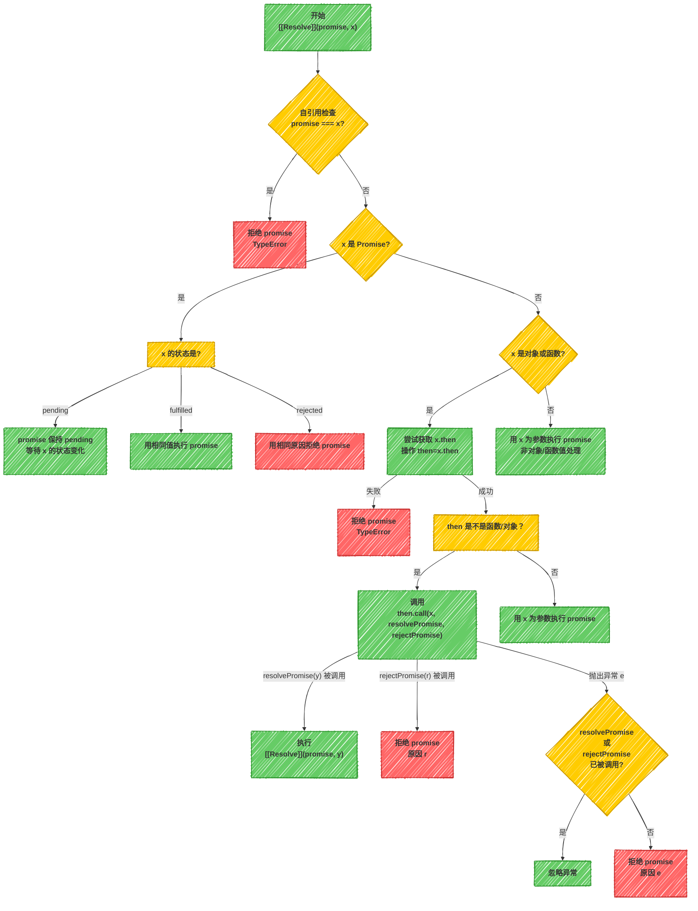

# 手写Promise

## Promise 基本结构 {#Promise基本结构}
Promise 的基本结构如下：

```js
class MyPromise {
  constructor(executor) {
    // executor 是一个执行器函数，接受两个参数 resolve 和 reject
    executor(this.resolve, this.reject);
  }
  // 定义 resolve 和 reject 方法，用于改变 Promise 的状态
  resolve(data) {}
  reject(err) {}

  // 定义 then 方法，用于注册成功和失败的回调
  then(onFulfilled, onRejected){}
}
```

## Promise 状态 {#Promise状态}
一个 Promise 的当前状态必须为以下三种状态中的一种：
- **挂起态/等待态** `pending`
- **执行态/成功态** `fulfilled`
- **拒绝态/失败态** `rejected`  

初始化状态为 `pending`，当调用 `resolve` 方法时，状态变为 `fulfilled`，当调用 `reject` 方法时，状态变为 `rejected`。  
状态一旦改变，就凝固了，不会再变。 
```js
// 定义状态常量
const PENDING = 'pending';
const FULFILLED = 'fulfilled';
const REJECTED = 'rejected';

class MyPromise {
  _status = PENDING;  // 初始为挂起状态pending
  _data = undefined;  // 完成状态下的相关数据（结果）
  _reason = undefined;  // 失败状态下的相关数据（原因）

  constructor(executor) {
    // executor 是一个执行器函数，接受两个参数 resolve 和 reject
    executor(this.resolve, this.reject);
  }
  // 定义 resolve 和 reject 方法，用于改变 Promise 的状态
  resolve(data) {}
  reject(err) {}

  // 定义 then 方法，用于注册成功和失败的回调
  then(onFulfilled, onRejected){}
}
```

## Promise拒绝 {#Promise拒绝}
reject 方法用于改变 Promise 的状态为失败，并传入一个失败的原因。
处于拒绝态时，promise 需满足以下条件：

- 不能迁移至其他任何状态
- 必须拥有一个不可变的据因


```javascript
// 定义 rejectPromise 方法，用于改变 Promise 的状态为失败
function rejectPromise(promise, reason) {
  if (promise._status !== PENDING) { 
    return;  // 如果状态不是挂起态，直接返回
  }
  // 只有在挂起态时才能改变状态
  promise._status = REJECTED;  // 改变状态为失败
  promise._reason = reason;  // 保存失败原因
}

class MyPromise {
  // 代码不变.....
  // 定义 reject 方法，用于改变 Promise 的状态为失败
  reject(err) {
    rejectPromise(this, err);
  }
}
```

## Promise成功 {#Promise成功}
resolve 方法用于改变 Promise 的状态为成功，并传入一个成功的结果。  
处于成功态时，promise 需满足以下条件：
- 不能迁移至其他任何状态
- 必须拥有一个不可变的值

promise解决过程可以看以下流程图：


代码如下：
```javascript
// 判断是否为对象
function isObject(val) {
  return val !== null && typeof val === 'object';
}

// 判断是否为函数
function isFunction(val) {
  return typeof val === 'function';
}

// 判断是否为 thenable 对象
function isThenable(x) {
  return (isObject(x) || isFunction(x)) && isFunction(x.then);
}

// 定义 resolvePromise 方法，用于改变 Promise 的状态为成功
function resolvePromise(promise, x) {
  if (promise._status !== PENDING) { 
    return;  // 如果状态不是挂起态，直接返回
  }

  // 如果x是一个thenable对象
  if (isThenable(x)) {
    // 1.如果 x 是 promise 本身，以 TypeError 为据因拒绝执行 promise
    if (x === promise) {
      rejectPromise(promise, new TypeError('Chaining cycle detected for promise #<MyPromise>'));
      return;
    }
    // 2.promise 吸收 x 的状态
    x.then(
      (data) => {
        // 如果 x 是成功状态，以相同的值完成 promise
        resolvePromise(promise, data);
      },
      (err) => {
        // 如果 x 是失败状态，以相同的据因拒绝 promise
        rejectPromise(promise, err);
      }
    );
  }else{
    promise._status = FULFILLED;  // 改变状态为成功
    promise._data = x;  // 保存成功结果
  }
}

class MyPromise {
  // 代码不变.....
  // 定义 resolve 方法，用于改变 Promise 的状态为成功
  resolve(data) {
    resolvePromise(this, data);
  }
}
```
::: tip 注意：
ES6的 Promise，状态吸收是放在微队列里的，使用`queueMicrotask`方法可以把任务添加到[微队列]()里去执行。
```javascript
queueMicrotask(() => {
  x.then(
    (data) => {
      resolvePromise(promise, data);
    },
    (err) => {
      rejectPromise(promise, err);
    }
  );
})

```
:::

## then 方法 {#then方法}
一个promise必须有 `then` 方法，`then`方法必须返回一个新的`promise`。  
`then`方法接收两个参数，第一个参数是`fulfilled`状态的回调，第二个参数是`rejected`状态的回调：
```javascript
promise.then(onFulfilled, onRejected){}
```
`onFulfilled` 和 `onRejected` 都是可选参数。

::: tip 提示
`then` 方法处理的核心问题就两个：
1. 确定 `then` 的 `onFulfilled` 和 `onRejected` 在什么时候调用
2. 确定 `then` 返回的新的 `promise` 的状态是什么
:::

```javascript
class MyPromise {
  // 代码不变.....
  // 定义 then 方法，用于注册成功和失败的回调
  then(onFulfilled, onRejected){
    // 创建一个新的 Promise 对象，用于返回
    const promise = new MyPromise((resolve, reject) => {})

    return promise;
  }

}
```


