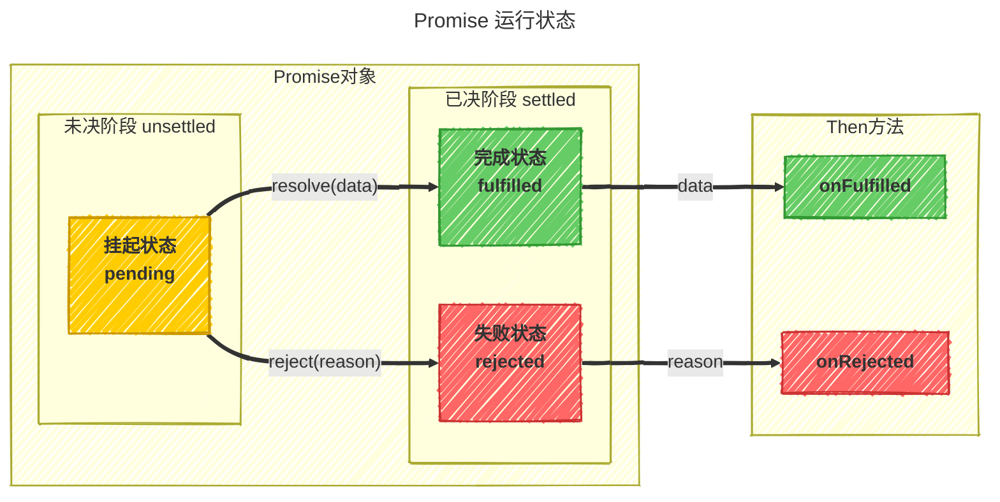

# 什么是 Promise
Promise 是 JavaScript 中用于处理异步操作的一种对象，它代表了一个异步操作的最终完成（或失败）及其结果值。简单来说，Promise 是一个承诺，承诺在未来某个时间点会返回一个结果。

## 相关文档 {#相关文档}
官方规范[Promises/A+](https://promisesaplus.com/)，翻译请看这里[Promise A+ 规范](https://malcolmyu.github.io/malnote/2015/06/12/Promises-A-Plus/)

MDN文档 [Promise](https://developer.mozilla.org/zh-CN/docs/Web/JavaScript/Reference/Global_Objects/Promise)，
[使用 Promise](https://developer.mozilla.org/zh-CN/docs/Web/JavaScript/Guide/Using_promises)

ECMAScript6 [Promise 对象](https://es6.ruanyifeng.com/#docs/promise)


## Promise 的含义 {#Promise的含义}
Promise是一个带then方法的对象，也就是说，你只要带then方法就是一个Promise，比如：
```javascript
const p1 = {
  then: function() {}
}

const p2 = new Promise()

function p3() {}
p3.then = function() {}
```
这些都是Promise，只不过不是严格的Promise，因为没有满足Promise/A+规范的要求。而这样的Promise，就叫 `thenable` 或者 `PromiseLike`。 

::: tip
如果一个`thenable/PromiseLike` 对象是一个严格符合`Promise/A+规范`的Promise，那么它就是一个**真正的** Promise。
:::

所以一般去判断一个对象是否是一个 Promise，可以判断这个对象是否包含 `then` 方法。
```javascript
function isPromiseLike(value) {
  return value && typeof value.then === 'function'
}
```

## Promise规范的核心 {#Promise规范的核心}
整个Promise规范就描述两块内容，一个是内部的Promise对象的运行状态，一个是外部的then方法。
<!--  -->
<div mermaid-zoom="false"></div>  



#### Promise对象 {#Promise对象}
Promise的运行状态可以归为两个阶段：
- **未决阶段 `unsettled`**  
  此时只有一个状态，即`挂起状态/等待状态：pending`，表示这个Promise对象还没有被决定，它可能成功也可能失败。
- **已决阶段 `settled`**  
  此时有两个状态，即`成功状态/执行状态：fulfilled`和`失败状态：rejected`，表示这个Promise对象已经成功或者失败了。运行状态只能从`pending`变成`fulfilled`，或者从`pending`变成`rejected`，并且状态一旦改变，就不会再变，会一直保持这个结果，这时就称为 resolved（已定型）。
  - **成功状态 `fulfilled`**  
    表示 Promise 成功完成，并且有一个值可用。
  - **失败状态 `rejected`**  
    表示 Promise 失败，并且有一个原因（错误）可用。


#### then方法 {#then方法}
Promise后续处理，用then方法去注册，它接收两个参数:
- `onFulfilled` 是成功回调，当 Promise 状态变成 `fulfilled` 时调用，它会接收 Promise 成功的结果作为参数。
- `onRejected` 是失败回调，当 Promise 状态变成 `rejected` 时调用，它会接收 Promise 失败的原因作为参数。

  这两个参数都是可选的，但是至少要提供一个。如果没有提供，那么就相当于没有处理这个状态。

:::tip
注意，规范中用 fulfill 来表示成功，reject 来表示失败，但是在 promise 实现多以 resolve 来指代成功状态，reject 来指代失败状态。
:::

## Promise 解决过程 {#Promise解决过程}
Promise 解决过程是一个抽象的操作，其需输入一个 `promise` 和一个值，我们表示为 `[[Resolve]](promise, x)`。如果 `x` 有 `then` 方法且看上去像一个 Promise，解决程序即尝试使 `promise` 接受 `x` 的状态；否则其用 `x` 的值来执行 `promise`。

这种 thenable 的特性使得 Promise 的实现更具有通用性：只要其暴露出一个遵循 Promise/A+ 协议的 then 方法即可；这同时也使遵循 Promise/A+ 规范的实现可以与那些不太规范但可用的实现能良好共存。

### 解决过程步骤 {#解决过程步骤}

`[[Resolve]](promise, x)` 的执行流程可以用以下流程图表示：


### 步骤详解 {#步骤详解}

1. **自引用检查**  
   如果 `promise` 和 `x` 相等（指向同一对象），以 `TypeError` 为据因拒绝 `promise`，防止循环引用。

2. **Promise 对象处理**  
   如果 `x` 为 Promise，则使 `promise` 接受/吸收 `x` 的状态：
   - 如果 `x` 是挂起态，`promise` 必须保持挂起态直至 `x` 被执行或拒绝
   - 如果 `x` 是执行态，用相同的值执行 `promise`
   - 如果 `x` 是拒绝态，用相同的据因拒绝 `promise`

3. **对象或函数处理**  
   否则，如果 `x` 为对象或函数：
   - 尝试获取 `x.then` 方法，把 `x.then` 赋值给 `then`
   - 如果获取 `x.then`，导致抛出异常 `e`，则以 `e` 为据因拒绝 `promise`
   - 如果 `then` 是一个函数，将 `x` 作为函数的作用域 `this` 调用之。第一个参数为 `resolvePromise`，第二个参数为 `rejectPromise` ，其中：
     - 如果/当 `resolvePromise` 被用值 `y` 调用时，则运行 `[[Resolve]](promise, y)`
     - 如果/当 `rejectPromise` 被调用并传入据因 `r` 时，则以据因 `r` 拒绝 `promise`
     - 如果 `resolvePromise` 和 `rejectPromise` 均被调用，或者被调用了多次，则只首次调用有效，其他调用均被忽略
     - 如果调用 `then` 方法抛出异常 `e`：
       - 如果 `resolvePromise` 或 `rejectPromise` 已被调用，则忽略之
       - 否则，以据因 `e` 拒绝 `promise`
   - 如果 `then` 不是函数，则用 `x` 为参数运行 `promise`
4. **非对象/函数值处理**  
   如果 `x` 不是一个对象或者函数，则用 `x` 为参数运行 `promise`

::: tip 提示
这个解决过程是 Promise/A+ 规范的核心，它确保了不同 Promise 实现之间的互操作性，使得我们可以混用不同库的 Promise 对象。
:::


## Promise 的链式调用 {#Promise的链式调用}

Promise的链式调用是其最强大的特性之一，它允许我们以更优雅的方式处理多个连续的异步操作。链式调用的核心在于`then()`方法会返回一个新的Promise对象。

### 链式调用的基本原理 {#链式调用的基本原理}

当调用Promise的`then()`方法时，它会返回一个新的Promise对象，这个新Promise的状态和值由`then()`方法的回调函数决定：

```javascript
// 基本链式调用示例
fetch('/api/user/1')
  .then(response => response.json()) // 返回一个新的Promise
  .then(user => {
    console.log('用户信息:', user);
    return fetch(`/api/posts/${user.id}`); // 返回另一个Promise
  })
  .then(response => response.json()) // 处理上一个Promise的结果
  .then(posts => {
    console.log('用户文章:', posts);
  })
  .catch(error => {
    console.error('发生错误:', error);
  });
```

### 链式调用中的值传递 {#链式调用中的值传递}

在链式调用中，每个`then()`回调函数的返回值会成为下一个`then()`回调函数的参数：

```javascript
Promise.resolve(5)
  .then(value => {
    console.log(value); // 输出: 5
    return value * 2; // 返回10
  })
  .then(value => {
    console.log(value); // 输出: 10
    return value + 3; // 返回13
  })
  .then(value => {
    console.log(value); // 输出: 13
  });
```

### 返回Promise对象 {#返回Promise对象}

当`then()`回调函数返回一个Promise对象时，链式调用会等待这个Promise解决后继续执行：

```javascript
function getUser(id) {
  return new Promise(resolve => {
    setTimeout(() => {
      resolve({ id, name: `用户${id}` });
    }, 1000);
  });
}

function getUserPosts(userId) {
  return new Promise(resolve => {
    setTimeout(() => {
      resolve([`文章1-用户${userId}`, `文章2-用户${userId}`]);
    }, 1000);
  });
}

getUser(1)
  .then(user => {
    console.log('获取到用户:', user);
    return getUserPosts(user.id); // 返回Promise
  })
  .then(posts => {
    console.log('获取到文章:', posts);
  });
```

### 错误传播 {#错误传播}

在链式调用中，错误会沿着链向下传播，直到被第一个`.catch()`捕获：

```javascript
Promise.resolve()
  .then(() => {
    throw new Error('第一个错误');
  })
  .then(() => {
    console.log('这里不会执行');
  })
  .then(() => {
    console.log('这里也不会执行');
  })
  .catch(error => {
    console.error('捕获到错误:', error.message); // 输出: 捕获到错误: 第一个错误
  });
```

### 多个catch的使用 {#多个catch的使用}

可以在链式调用中添加多个`.catch()`，每个`.catch()`可以处理前一个阶段产生的错误：

```javascript
Promise.resolve()
  .then(() => {
    throw new Error('第一个错误');
  })
  .catch(error => {
    console.error('第一个catch:', error.message);
    // 如果不返回一个被拒绝的Promise，链会继续执行
    return '恢复后的值';
  })
  .then(value => {
    console.log('继续执行:', value); // 输出: 继续执行: 恢复后的值
    throw new Error('第二个错误');
  })
  .catch(error => {
    console.error('第二个catch:', error.message); // 输出: 第二个catch: 第二个错误
  });
```

### then的第二个参数 {#then的第二个参数}

`then()`方法可以接收第二个参数作为错误回调，但通常更推荐使用`.catch()`：

```javascript
// 使用then的第二个参数处理错误
Promise.resolve()
  .then(
    () => {
      throw new Error('发生错误');
    },
    error => {
      console.error('在then中捕获错误:', error.message);
    }
  );

// 使用catch处理错误（推荐）
Promise.resolve()
  .then(() => {
    throw new Error('发生错误');
  })
  .catch(error => {
    console.error('在catch中捕获错误:', error.message);
  });
```

### finally方法 {#finally方法}

`finally()`方法无论Promise是成功还是失败都会执行，通常用于清理操作：

```javascript
let isLoading = true;

fetch('/api/data')
  .then(response => response.json())
  .then(data => {
    console.log('数据:', data);
  })
  .catch(error => {
    console.error('错误:', error);
  })
  .finally(() => {
    isLoading = false;
    console.log('加载完成');
  });
```

### 链式调用的最佳实践 {#链式调用的最佳实践}

1. **保持链式调用的简洁性**
   ```javascript
   // 不推荐：过深的嵌套
   fetch('/api/user')
     .then(response => {
       return response.json().then(user => {
         return fetch(`/api/posts/${user.id}`).then(response => {
           return response.json().then(posts => {
             console.log(posts);
           });
         });
       });
     });

   // 推荐：扁平化的链式调用
   fetch('/api/user')
     .then(response => response.json())
     .then(user => fetch(`/api/posts/${user.id}`))
     .then(response => response.json())
     .then(posts => console.log(posts));
   ```

2. **始终添加错误处理**
   ```javascript
   // 不推荐：缺少错误处理
   fetch('/api/data')
     .then(response => response.json())
     .then(data => console.log(data));

   // 推荐：添加错误处理
   fetch('/api/data')
     .then(response => response.json())
     .then(data => console.log(data))
     .catch(error => console.error('请求失败:', error));
   ```

3. **合理使用Promise.all()处理并行操作**
   ```javascript
   // 获取用户信息和文章列表并行执行
   Promise.all([
     fetch('/api/user').then(response => response.json()),
     fetch('/api/posts').then(response => response.json())
   ])
     .then(([user, posts]) => {
       console.log('用户:', user);
       console.log('文章:', posts);
     })
     .catch(error => console.error('请求失败:', error));
   ```

4. **使用async/await简化链式调用**
   ```javascript
   // 传统链式调用
   fetch('/api/user')
     .then(response => response.json())
     .then(user => fetch(`/api/posts/${user.id}`))
     .then(response => response.json())
     .then(posts => console.log(posts))
     .catch(error => console.error('请求失败:', error));

   // 使用async/await（更简洁）
   async function fetchUserPosts() {
     try {
       const userResponse = await fetch('/api/user');
       const user = await userResponse.json();
       const postsResponse = await fetch(`/api/posts/${user.id}`);
       const posts = await postsResponse.json();
       console.log(posts);
     } catch (error) {
       console.error('请求失败:', error);
     }
   }
   ```

Promise的链式调用为异步编程提供了强大而灵活的工具，通过合理使用这些模式，可以编写出清晰、可维护的异步代码。


## Promise 的优缺点 {#Promise的优缺点}
Promise 作为异步编程的解决方案，既有其优势也有其局限性，理解这些特性有助于我们在合适的场景下使用它。

### 优势 {#优势}
1. **解决回调地狱**  
   传统回调函数容易形成嵌套层级过深的"回调地狱"，Promise 通过链式调用解决了这个问题，使代码结构更加清晰。

2. **更好的错误处理**  
   Promise 提供了统一的错误处理机制，通过 `.catch()` 可以捕获链式调用中的任何错误，避免了传统回调中错误处理不一致的问题。

3. **更好的可读性和可维护性**  
   Promise 的链式调用使代码更加线性，更易于理解和维护，特别是在处理多个连续的异步操作时。

### 局限性 {#局限性}
1. **无法取消**  
   一旦 Promise 被创建，它就会立即开始执行，无法中途取消。这在某些需要取消操作的场景下可能会造成资源浪费。

2. **错误处理容易被忽略**  
   如果不设置回调函数，Promise 内部抛出的错误不会反应到外部。传统的错误处理机制是通过回调函数来实现的，而 Promise 则需要通过 `.catch()` 来捕获错误。如果忘记了添加 `.catch()`，那么错误就会被静默掉，导致调试困难。

3. **无法得知进度**  
   当 Promise 处于 `pending` 状态时，无法得知目前进展到哪一个阶段（刚刚开始还是即将完成）。这是因为 Promise 的设计是"一次性"的，它只关心最终结果，而不关心中间过程。对于需要显示进度信息的场景（如文件上传、大文件处理等），Promise 本身并不提供支持。

### 使用建议 {#使用建议}
基于以上特性，以下是一些使用 Promise 的建议：

- **适合场景**：单次异步操作、需要链式处理的多个异步操作、需要统一错误处理的场景
- **不适合场景**：需要取消的操作、需要进度反馈的操作、需要多次触发的事件处理
- **最佳实践**：始终添加 `.catch()` 处理错误、合理使用 `Promise.all()` 和 `Promise.race()` 处理多个 Promise、在需要进度或取消功能的场景考虑使用其他方案（如 Observable 或 AbortController）
