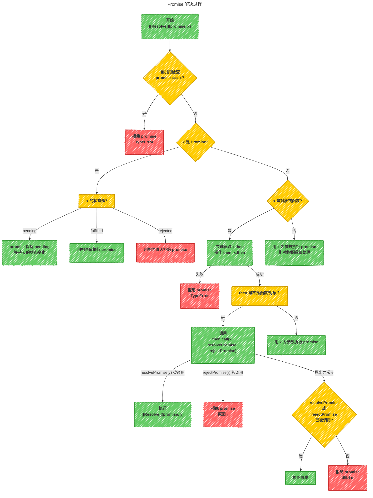
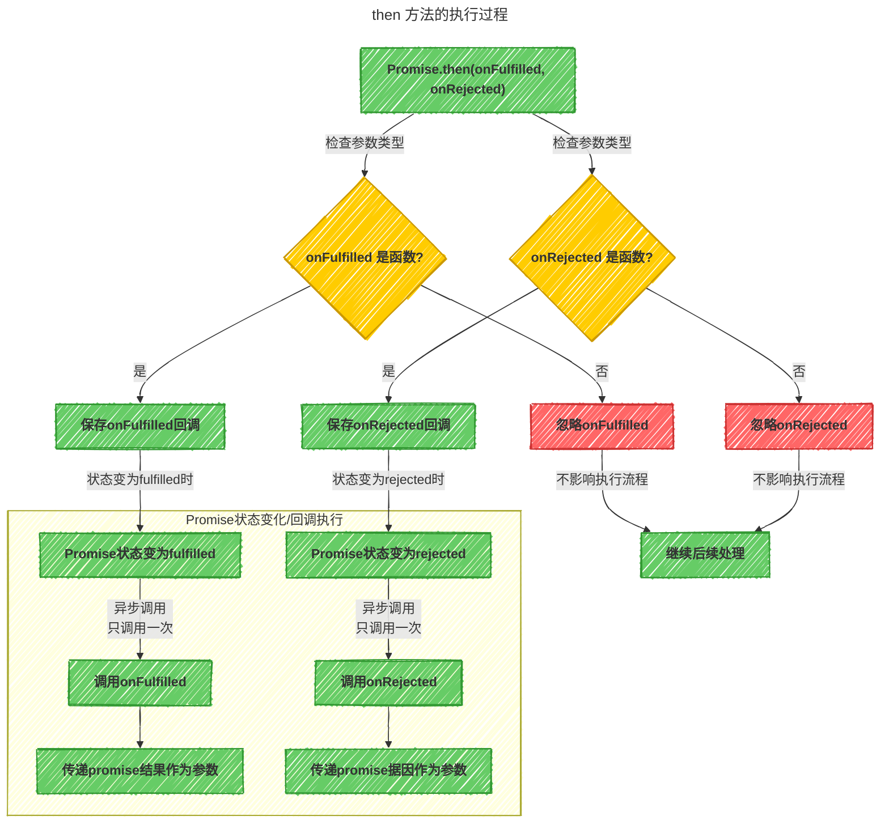

# 手写 Promise

## Promise 基本结构 {#Promise-基本结构}

Promise 的基本结构如下：

```js
class MyPromise {
  constructor(executor) {
    // executor 是一个执行器函数，接受两个参数 resolve 和 reject
    executor(this.resolve, this.reject);
  }
  // 定义 resolve 和 reject 方法，用于改变 Promise 的状态
  resolve(data) {}
  reject(err) {}

  // 定义 then 方法，用于注册成功和失败的回调
  then(onFulfilled, onRejected) {}
}
```

## Promise 状态 {#Promise-状态}

一个 Promise 的当前状态必须为以下三种状态中的一种：

- **挂起态/等待态** `pending`
- **执行态/成功态** `fulfilled`
- **拒绝态/失败态** `rejected`

初始化状态为 `pending`，当调用 `resolve` 方法时，状态变为 `fulfilled`，当调用 `reject` 方法时，状态变为 `rejected`。  
状态一旦改变，就凝固了，不会再变。

```js
// 定义状态常量
const PENDING = 'pending';
const FULFILLED = 'fulfilled';
const REJECTED = 'rejected';

class MyPromise {
  _status = PENDING; // 初始为挂起状态pending
  _data = undefined; // 完成状态下的相关数据（结果）
  _reason = undefined; // 失败状态下的相关数据（原因）

  constructor(executor) {
    // executor 是一个执行器函数，接受两个参数 resolve 和 reject
    executor(this.resolve, this.reject);
  }
  // 定义 resolve 和 reject 方法，用于改变 Promise 的状态
  resolve(data) {}
  reject(err) {}

  // 定义 then 方法，用于注册成功和失败的回调
  then(onFulfilled, onRejected) {}
}
```

## Promise 拒绝 {#Promise-拒绝}

reject 方法用于改变 Promise 的状态为失败，并传入一个失败的原因。
处于拒绝态时，promise 需满足以下条件：

- 不能迁移至其他任何状态
- 必须拥有一个不可变的据因

```javascript
// 定义 rejectPromise 方法，用于改变 Promise 的状态为失败
function rejectPromise(promise, reason) {
  if (promise._status !== PENDING) {
    return; // 如果状态不是挂起态，直接返回
  }
  // 只有在挂起态时才能改变状态
  promise._status = REJECTED; // 改变状态为失败
  promise._reason = reason; // 保存失败原因
}

class MyPromise {
  // 代码不变.....
  // 定义 reject 方法，用于改变 Promise 的状态为失败
  reject(err) {
    rejectPromise(this, err);
  }
}
```

## Promise 成功 {#Promise-成功}

resolve 方法用于改变 Promise 的状态为成功，并传入一个成功的结果。  
处于成功态时，promise 需满足以下条件：

- 不能迁移至其他任何状态
- 必须拥有一个不可变的值

promise 解决过程可以看以下流程图：



代码如下：

```javascript
// 判断是否为对象
function isObject(val) {
  return val !== null && typeof val === 'object';
}

// 判断是否为函数
function isFunction(val) {
  return typeof val === 'function';
}

// 判断是否为 thenable 对象
function isThenable(x) {
  return (isObject(x) || isFunction(x)) && isFunction(x.then);
}

// 定义 resolvePromise 方法，用于改变 Promise 的状态为成功
function resolvePromise(promise, x) {
  if (promise._status !== PENDING) {
    return; // 如果状态不是挂起态，直接返回
  }

  // 如果x是一个thenable对象
  if (isThenable(x)) {
    // 1.如果 x 是 promise 本身，以 TypeError 为据因拒绝执行 promise
    if (x === promise) {
      rejectPromise(promise, new TypeError('Chaining cycle detected for promise #<MyPromise>'));
      return;
    }
    // 2.promise 吸收 x 的状态
    x.then(
      (data) => {
        // 如果 x 是成功状态，以相同的值完成 promise
        resolvePromise(promise, data);
      },
      (err) => {
        // 如果 x 是失败状态，以相同的据因拒绝 promise
        rejectPromise(promise, err);
      }
    );
  } else {
    promise._status = FULFILLED; // 改变状态为成功
    promise._data = x; // 保存成功结果
  }
}

class MyPromise {
  // 代码不变.....
  // 定义 resolve 方法，用于改变 Promise 的状态为成功
  resolve(data) {
    resolvePromise(this, data);
  }
}
```

::: tip 注意：
ES6 的 Promise，状态吸收是放在微队列里的，使用`queueMicrotask`方法可以把任务添加到[微队列](../1.事件循环/2.事件循环#微队列)里去执行。

```javascript
queueMicrotask(() => {
  x.then(
    (data) => {
      resolvePromise(promise, data);
    },
    (err) => {
      rejectPromise(promise, err);
    }
  );
});
```

:::

## then 方法 {#then-方法}

`then` 方法接收两个参数，第一个参数是`fulfilled`状态的回调，第二个参数是`rejected`状态的回调：

```javascript
promise.then(onFulfilled, onRejected){}
```

一个 promise 必须有 `then` 方法，`then` 方法必须返回一个新的 `promise`。

```javascript
class MyPromise {
  // 代码不变.....
  // 定义 then 方法，用于注册成功和失败的回调
  then(onFulfilled, onRejected) {
    // 创建一个新的 Promise 对象，用于返回
    const promise2 = new MyPromise((resolve, reject) => {});

    return promise2;
  }
}
```

::: tip 提示
`then` 方法处理的核心问题就两个：

1. 确定 `then` 的 `onFulfilled` 和 `onRejected` 在什么时候调用
2. 确定 `then` 返回的新的 `promise` 的状态是什么
   :::

`then` 可以调用多次，所以需要数组来存储多个回调

```javascript
// 处理已决后的回调函数
// 将 curPromise 中的所有回调进行处理
function callSettledCallbacks(curPromise) {}

class MyPromise {
  // then可以调用多次，所以需要数组来存储多个回调
  _settledCallbacks = []; // 当前 Promise 实例已决后要进行的后续处理

  // 代码不变.....

  // 定义 then 方法，用于注册成功和失败的回调
  then(onFulfilled, onRejected) {
    // 创建一个新的 Promise 对象，用于返回
    const promise2 = new MyPromise((resolve, reject) => {});
    _settledCallbacks.push({
      onFulfilled,
      onRejected,
      promise2 // 后续处理的 Promise 实例
    });
    return promise2;
  }
}
```

存储后，在适当的时机去调用这些回调：

- 当 `promise` 状态变化时（从 `pending` 到 `fulfilled` 或 `rejected`）：
  ```javascript
  // 在这段代码中，因为resolve是异步执行的，所以会先执行then去注册回调，后执行resolve去变化状态
  // 所以在状态变化后，会调用这些then注册的回调
  const promise = new MyPromise((resolve, reject) => {
    setTimeout(() => {
      resolve(123);
    }, 1000);
  });
  promise.then(
    (data) => {
      console.log('success', data);
    },
    (err) => {
      console.log('error', err);
    }
  );
  ```
- 当 `then` 方法被调用时：
  ```javascript
  // 在这段代码中，因为resolve是同步执行的，所以会先执行resolve去变化状态，后执行then去注册回调
  // 所以在then注册的回调时，如果状态已经变化了，就会立即调用回调
  const promise = new MyPromise((resolve, reject) => {
    resolve(123);
  });
  promise.then(
    (data) => {
      console.log('success', data); // 123
    },
    (err) => {
      console.log('error', err);
    }
  );
  ```
  根据以上时机去调用:

```javascript
// 代码不变

// 定义 rejectPromise 方法，用于改变 Promise 的状态为失败
function rejectPromise(promise, reason) {
  if (promise._status !== PENDING) {
    return; // 如果状态不是挂起态，直接返回
  }
  // 只有在挂起态时才能改变状态
  promise._status = REJECTED; // 改变状态为失败
  promise._reason = reason; // 保存失败原因

  // 调用已决后的回调函数
  callSettledCallbacks(promise);
}

// 定义 resolvePromise 方法，用于改变 Promise 的状态为成功
function resolvePromise(promise, x) {
  if (promise._status !== PENDING) {
    return; // 如果状态不是挂起态，直接返回
  }

  // 如果x是一个thenable对象
  if (isThenable(x)) {
    // 代码不变
  } else {
    promise._status = FULFILLED; // 改变状态为成功
    promise._data = x; // 保存成功结果

    // 调用已决后的回调函数
    callSettledCallbacks(promise);
  }
}

// 处理已决后的回调函数
// 将 curPromise 中的所有回调进行处理
function callSettledCallbacks(curPromise) {}

class MyPromise {
  // then可以调用多次，所以需要数组来存储多个回调
  _settledCallbacks = []; // 当前 Promise 实例已决后要进行的后续处理

  // 代码不变.....

  // 定义 then 方法，用于注册成功和失败的回调
  then(onFulfilled, onRejected) {
    // 创建一个新的 Promise 对象，用于返回
    const promise2 = new MyPromise((resolve, reject) => {});
    _settledCallbacks.push({
      onFulfilled,
      onRejected,
      promise2 // 后续处理的 Promise 实例
    });
    // 调用已决后的回调函数
    callSettledCallbacks(this);
    return promise2;
  }
}
```

`onFulfilled` 和 `onRejected` 的处理过程可以用以下流程图表示：



### 步骤详解 {#步骤详解}

- `onFulfilled` 和 `onRejected` 都是可选参数。
  - 如果 `onFulfilled` 不是函数，必须忽略它（即状态穿透）。
  - 如果 `onRejected` 不是函数，必须忽略它（即状态穿透）。
- 如果 `onFulfilled` 是函数，
  - 当 `promise` 执行结束后（状态为 `fulfilled`） 时，必须异步调用 `onFulfilled`，并将 `promise` 的结果作为参数。
  - 在 `promise` 执行结束前，`onFulfilled` 不可被调用。
  - 调用次数不能超过一次。
- 如果 `onRejected` 是函数，
  - 当 `promise` 执行结束后（状态为 `rejected`） 时，必须异步调用 `onRejected`，并将 `promise` 的据因作为参数。
  - 在 `promise` 执行结束前，`onRejected` 不可被调用。
  - 调用次数不能超过一次。

在 `Promise/A+` 规范中，要确保 `onFulfilled` 和 `onRejected` 方法异步执行，且应该在 `then` 方法被调用的那一轮[事件循环](../1.事件循环/2.事件循环)之后的新执行栈中执行。这个事件队列可以采用"宏队列（`macro-task`）"机制或者"微队列（`micro-task`）"机制来实现。而在 ES6 中是放在了微队列，所以我们按照 ES6 的处理来实现。

```javascript
// 处理已决后的回调函数
// 将 curPromise 中的所有回调进行处理
function callSettledCallbacks(curPromise) {
  if (curPromise._status === PENDING) {
    return;
  }
  // 必须在已决之后处理
  // 获取所有的回调
  const settledCallbacks = curPromise._settledCallbacks;
  // 将后续的处理放到微队列
  queueMicrotask(() => {
    // 循环所有已决后的回调，并把执行之后的回调清除（每个回调只运行一次）
    while (settledCallbacks.length) {
      // 取出第一个回调
      const callback = settledCallbacks.shift();
      const { onFulfilled, onRejected, promise2 } = callback;
      // 当前的Promise完成，但完成的回调不是函数，则状态穿透
      if (!isFunction(onFulfilled) && curPromise._status === FULFILLED) {
        // 状态穿透，把curPromise的结果传递给promise2
        resolvePromise(promise2, curPromise._data);
        continue;
      }
      // 当前的Promise失败，但失败的回调不是函数，则状态穿透
      if (!isFunction(onRejected) && curPromise._status === REJECTED) {
        // 状态穿透，把curPromise的据因传递给promise2
        rejectPromise(promise2, curPromise._reason);
        continue;
      }
      let resule;
      try {
        result =
          curPromise._status === FULFILLED
            ? onFulfilled(curPromise._data)
            : onRejected(curPromise._reason);
      } catch (err) {
        // 处理回调函数执行时的错误
        rejectPromise(promise2, err);
      }
      // 处理正常的回调返回值
      resolvePromise(promise2, result);
    }
  });
}
```

至此，符合 `Promise/A+` 规范的 `Promise` 就完成了，至于其他的方法，如 `catch`、`finally` 等，都是基于 `then` 方法的封装。

## 完整代码 {#完整代码}

```javascript
// 定义状态常量
const PENDING = 'pending';
const FULFILLED = 'fulfilled';
const REJECTED = 'rejected';

// 判断是否为对象
function isObject(val) {
  return val !== null && typeof val === 'object';
}

// 判断是否为函数
function isFunction(val) {
  return typeof val === 'function';
}

// 判断是否为 thenable 对象
function isThenable(x) {
  return (isObject(x) || isFunction(x)) && isFunction(x.then);
}

// 定义 rejectPromise 方法，用于改变 Promise 的状态为失败
function rejectPromise(promise, reason) {
  if (promise._status !== PENDING) {
    return; // 如果状态不是挂起态，直接返回
  }
  // 只有在挂起态时才能改变状态
  promise._status = REJECTED; // 改变状态为失败
  promise._reason = reason; // 保存失败原因

  // 调用已决后的回调函数
  callSettledCallbacks(promise);
}

// 定义 resolvePromise 方法，用于改变 Promise 的状态为成功
function resolvePromise(promise, x) {
  if (promise._status !== PENDING) {
    return; // 如果状态不是挂起态，直接返回
  }

  // 如果x是一个thenable对象
  if (isThenable(x)) {
    // 1.如果 x 是 promise 本身，以 TypeError 为据因拒绝执行 promise
    if (x === promise) {
      rejectPromise(promise, new TypeError('Chaining cycle detected for promise #<MyPromise>'));
      return;
    }
    // 2.promise 吸收 x 的状态
    x.then(
      (data) => {
        // 如果 x 是成功状态，以相同的值完成 promise
        resolvePromise(promise, data);
      },
      (err) => {
        // 如果 x 是失败状态，以相同的据因拒绝 promise
        rejectPromise(promise, err);
      }
    );
  } else {
    promise._status = FULFILLED; // 改变状态为成功
    promise._data = x; // 保存成功结果

    // 调用已决后的回调函数
    callSettledCallbacks(promise);
  }
}

// 处理已决后的回调函数
// 将 curPromise 中的所有回调进行处理
function callSettledCallbacks(curPromise) {
  if (curPromise._status === PENDING) {
    return;
  }
  // 必须在已决之后处理
  // 获取所有的回调
  const settledCallbacks = curPromise._settledCallbacks;
  // 将后续的处理放到微队列
  queueMicrotask(() => {
    // 循环所有已决后的回调，并把执行之后的回调清除（每个回调只运行一次）
    while (settledCallbacks.length) {
      // 取出第一个回调
      const callback = settledCallbacks.shift();
      const { onFulfilled, onRejected, promise2 } = callback;
      // 当前的Promise完成，但完成的回调不是函数，则状态穿透
      if (!isFunction(onFulfilled) && curPromise._status === FULFILLED) {
        // 状态穿透，把curPromise的结果传递给promise2
        resolvePromise(promise2, curPromise._data);
        continue;
      }
      // 当前的Promise失败，但失败的回调不是函数，则状态穿透
      if (!isFunction(onRejected) && curPromise._status === REJECTED) {
        // 状态穿透，把curPromise的据因传递给promise2
        rejectPromise(promise2, curPromise._reason);
        continue;
      }
      let resule;
      try {
        result =
          curPromise._status === FULFILLED
            ? onFulfilled(curPromise._data)
            : onRejected(curPromise._reason);
      } catch (err) {
        // 处理回调函数执行时的错误
        rejectPromise(promise2, err);
      }
      // 处理正常的回调返回值
      resolvePromise(promise2, result);
    }
  });
}

class MyPromise {
  _status = PENDING; // 初始为挂起状态pending
  _data = undefined; // 完成状态下的相关数据（结果）
  _reason = undefined; // 失败状态下的相关数据（原因）

  // then可以调用多次，所以需要数组来存储多个回调
  _settledCallbacks = []; // 当前 Promise 实例已决后要进行的后续处理

  constructor(executor) {
    // executor 是一个执行器函数，接受两个参数 resolve 和 reject
    executor(this.resolve, this.reject);
  }

  // 定义 reject 方法，用于改变 Promise 的状态为失败
  reject(err) {
    rejectPromise(this, err);
  }

  // 定义 resolve 方法，用于改变 Promise 的状态为成功
  resolve(data) {
    resolvePromise(this, data);
  }

  // 定义 then 方法，用于注册成功和失败的回调
  then(onFulfilled, onRejected) {
    // 创建一个新的 Promise 对象，用于返回
    const promise2 = new MyPromise((resolve, reject) => {});
    _settledCallbacks.push({
      onFulfilled,
      onRejected,
      promise2 // 后续处理的 Promise 实例
    });
    // 调用已决后的回调函数
    callSettledCallbacks(this);
    return promise2;
  }
}
```
