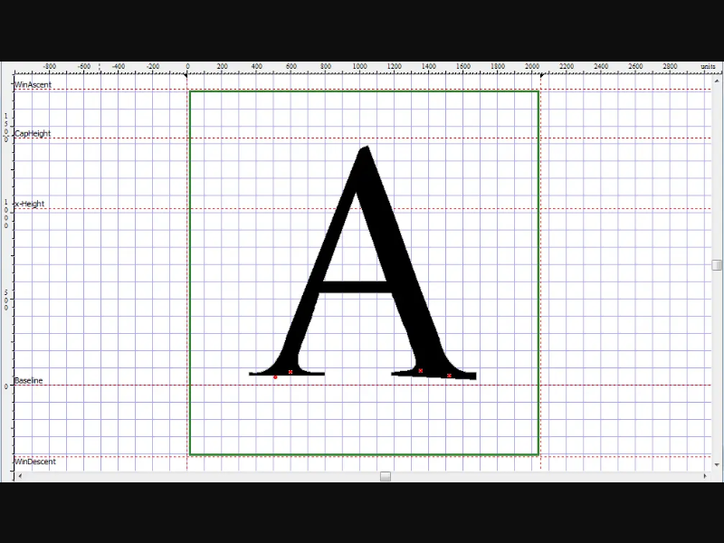
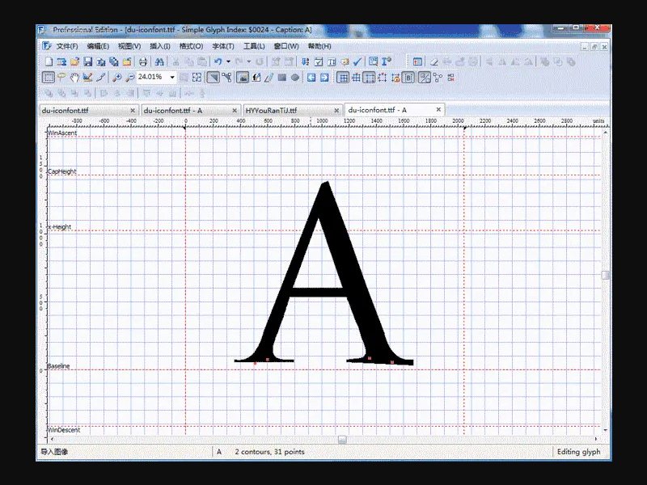
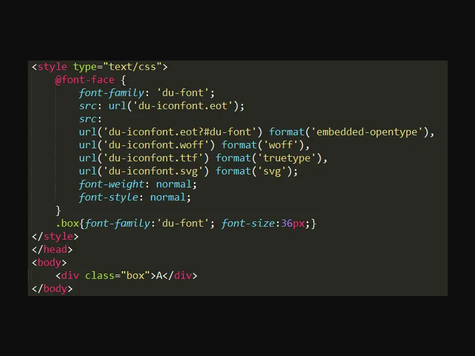
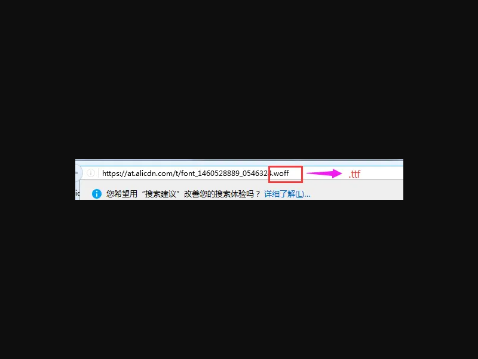
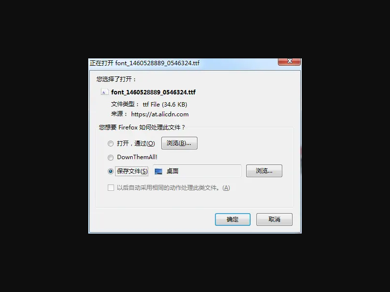
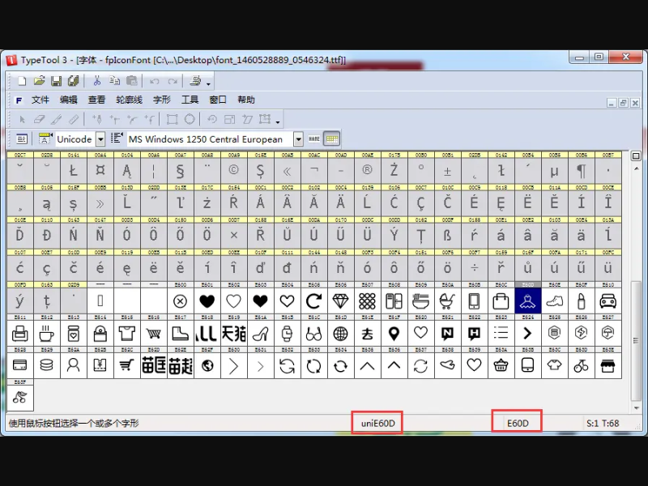
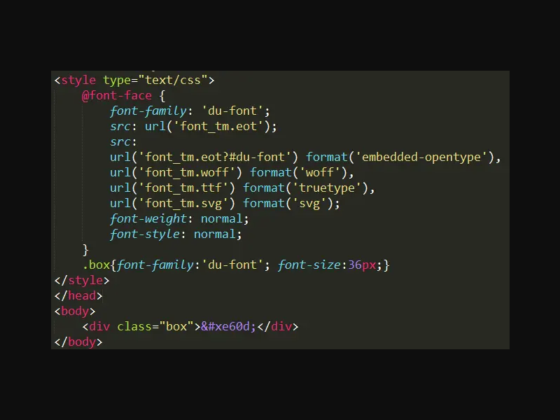
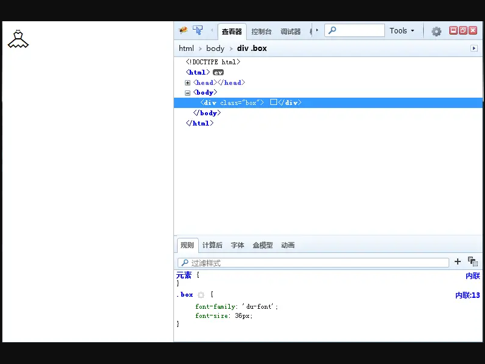

# 解密 Iconfont {#解密-iconfont}


## 概述 {#概述}

本文将深入解析 Iconfont（图标字体）的概念、原理、制作方法以及实际应用，帮助开发者全面了解并掌握这一前端技术。

## 什么是 Iconfont？ {#什么是-iconfont}

> **icon font**，图标字体，也叫字体图标，顾名思义，就是字体做的图标。受到近些年 **扁平化设计** 的影响，越来越多的图标都开始使用 **iconfont**。

### 优点 {#优点}

1. **自由缩放**：可以自由变化大小，且不会模糊
2. **加载速度快**：比图片小，加载快
3. **颜色灵活**：可以任意改变颜色

### 缺点 {#缺点}

1. **颜色限制**：只能被渲染成单色或者CSS3的渐变色
2. **制作复杂**：创作自己的字体图标很费时间，重构人员后期维护的成本偏高

::: tip
虽然 Iconfont 有一些限制，但在大多数场景下，其优势远大于劣势，特别是在需要大量使用图标的现代Web应用中。
:::


## WebFont 基础 {#webfont-基础}

在深入了解 Iconfont 之前，我们先了解一下 WebFont 的基础知识。

### WebFont 简介 {#webfont-简介}

> 我们都知道，在网页制作中，会经常用到不同的字体，常用的有 **微软雅黑**、**宋体**、**Arial** 等等。在我们写CSS样式的时候，通过 **font-family** 可以指定元素的字体名称。
> 
> 如果是 **特殊字体**，因为我们的电脑没有安装那个字体，所以在网页中显示不出来，所以我们通过 **@font-face** 来引入特殊字体。

### @font-face 语法规则 {#font-face-语法规则}

```css
@font-face {
    font-family: <YourWebFontName>;
    src: <source> [<format>][,<source> [<format>]]*;
    [font-weight: <weight>];
    [font-style: <style>];
}
```

#### 取值说明 {#取值说明}

| 参数 | 说明 |
|------|------|
| YourWebFontName | 字体名称，将被引用到元素的 **font-family** 上 |
| source | 字体的存放路径，跟CSS引用图片一样 |
| format | 字体的格式，主要用来帮助浏览器识别，其值主要有以下几种类型：**truetype**、**opentype**、**truetype-aat**、**embedded-opentype**、**svg** 等 |
| weight | 定义字体是否为粗体 |
| style | 主要定义字体样式，如斜体 |

### 浏览器兼容性 {#浏览器兼容性}


### 兼容写法 {#兼容写法}

```css
@font-face {
    font-family: 'YourWebFontName';
    src: url('YourWebFontName.eot'); /* IE9 Compat Modes */
    src: url('YourWebFontName.eot?#iefix') format('embedded-opentype'), /* IE6-IE8 */
         url('YourWebFontName.woff') format('woff'), /* Modern Browsers */
         url('YourWebFontName.ttf')  format('truetype'), /* Safari, Android, iOS */
         url('YourWebFontName.svg#YourWebFontName') format('svg'); /* Legacy iOS */
}
```

### 字体格式详解 {#字体格式详解}

| 格式 | 特点 | 支持的浏览器 |
|------|------|-------------|
| **TrueType(.ttf)** | Windows和Mac的最常见的字体，是一种RAW格式，因此它不为网站优化 | IE9+、Firefox3.5+、Chrome4+、Safari3+、Opera10+、iOS Mobile Safari4.2+ |
| **OpenType(.otf)** | 被认为是一种原始的字体格式，其内置在TrueType的基础上，所以也提供了更多的功能 | Firefox3.5+、Chrome4.0+、Safari3.1+、Opera10.0+、iOS Mobile Safari4.2+ |
| **Web Open Font Format(.woff)** | Web字体中最佳格式，它是一个开放的TrueType/OpenType的压缩版本，同时也支持元数据包的分离 | IE9+、Firefox3.5+、Chrome6+、Safari3.6+、Opera11.1+ |
| **Embedded Open Type(.eot)** | IE专用字体，可以从TrueType创建此格式字体 | IE4+ |

::: tip
在Web开发中，为了确保最大程度的浏览器兼容性，通常需要同时提供多种字体格式。其中.woff是现代浏览器的首选格式，而.eot则是为了兼容旧版IE浏览器。
:::

### 中文字体的特殊处理 {#中文字体的特殊处理}

**WebFont** 技术可以让网页使用在线字体，在国外，**WebFont** 已经非常流行了，大量的网站使用了 **WebFont** 技术，而业界大佬 Google 也顺势推出的免费 **WebFont** 云托管服务，这一切均带动了国外字体制作行业的高速发展。

为什么是国外呢，那是因为中文字体比较尴尬，英文字体只有26个字母，一套字体不过几十 **KB**，而汉字却有数万个，导致字体文件通常有好几 **MB** 大小，再加上国内的网络环境，显然不现实。

所以中文的 **特殊字体** 必须经过压缩才能使用，怎么压缩呢，请看 **腾讯ISUX** 开发的 [中文字体压缩器--字蛛（FontSpider）](http://font-spider.org/)。

::: tip
因为这篇主要讲的是 **iconfont**，所以我就不详细讲 [字蛛](http://font-spider.org/) 的使用方法了，[字蛛](http://font-spider.org/) 官网很详细。
:::

---

## Iconfont 原理 {#iconfont-原理}

### 基本概念 {#基本概念}

> 每种字体在相同的字都是不一样的，比如 **宋体** 跟 **微软雅黑**，相同的字，由于调用的不同的字体，浏览器显示明显是有区别的。

### 工作原理 {#工作原理}

#### 字符与图标的映射 {#字符与图标的映射}

在我们还不识字的时候，每个字都是一个图案，所以老师会告诉你哪个图案念什么，是什么字，**iconfont** 同理，我认为 **三角形** 是 **a**，那对于我来说，只要是 **a**，就应该是个 **三角形**。

在电脑上，我给电脑规定 **a** 的样子是个 **三角形**，那么当显示 **a** 的时候，他就显示个三角形。

#### 字体库的构建 {#字体库的构建}

当我把网页上的所有图标都对应一个字符的时候，你在代码里输入某个字符，那这个字符就显示你规定的形状，这就是 **iconfont** 图标。

把所有的图标都放在一个字体里面，就是一个字体库了，然后按照正常字体库（本来就是正常的字体库）调用就行了。

::: tip
Iconfont 的核心思想是将图标作为字体字符来处理，通过字符编码与图标形状的映射关系，实现图标的显示。这种方式不仅减小了文件大小，还提供了灵活的样式控制能力。
:::

### 核心概念 {#核心概念}

1. **字符映射**：将特定字符映射到特定图标形状
2. **字体渲染**：浏览器根据字体文件渲染字符为对应图标
3. **样式控制**：通过CSS控制图标的大小、颜色等样式


## Iconfont 的制作 {#iconfont-的制作}

### 传统制作方法 {#传统制作方法}

> 最初制作 **iconfont** 都是在字体制作软件里面制作，比如 **FontLab**、**TypeTool**、**FontCreator** 之类的专业软件，我最开始的时候是使用的 **FontCreator** 来制作，我现在简单的给大家演示一下。

#### 步骤详解 {#步骤详解}

1. **新建字体文件**
   
   

2. **复制和粘贴字符**
   
   随便打开一个字体，选中某个字符，**Ctrl+C** 复制，然后选中新建的字体的某个字符，**Ctrl+V** 粘贴。右键这个字符，**编辑**。
   
   

3. **了解字体区域**
   
   我们可以大概知道字体区域，我们做的图标也大概在这个区域
   
   

4. **准备图标素材**
   
   随便找张图，比如中国移动的图标
   
   

5. **导入图标到字体**
   
   把这张图导入到刚才的字体中
   
   

6. **调整和保存**
   
   调整图片的位置，把原先的图形选中，**Delete** 删掉，保存
   
   

7. **在网页中测试**
   
   
   

8. **完成制作**
   
   一个 **icon** 就做好了，然后其他的也是这种方法

#### 字体格式转换 {#字体格式转换}

因为为了兼容，必须转换成四种格式，本地转换的工具很少，只能在在线转，这是国外的几个地址：

- [fontsquirrel](https://www.fontsquirrel.com/tools/webfont-generator)
- [freefontconverter](http://www.freefontconverter.com/)
- [font2web](http://www.font2web.com/)

### 现代制作方法 {#现代制作方法}

这样用字体软件做图标会很麻烦，有没有简单的办法呢？答案是肯定的，由 **阿里妈妈UED** 开发的 [Iconfont-阿里巴巴矢量图标库](http://www.iconfont.cn/) 会帮大家快速的生成 **iconfont**。具体的制作方法请查看 [Iconfont.cn](http://www.iconfont.cn/) 提供的 [图标制作说明](http://www.iconfont.cn/help/iconmake.html?spm=a313x.7781069.0.0.DY1v1s)。

[Iconfont.cn](http://www.iconfont.cn/) 上有大量的 **iconfont** 图标，可以快速的搜索，然后加到自己的项目中，网站可以用你的 **新浪微博** 登录。

#### 阿里巴巴 Iconfont 平台优势 {#阿里巴巴-iconfont-平台优势}

1. **海量图标库**：提供大量现成的图标资源
2. **在线编辑**：支持在线编辑和生成图标字体
3. **项目管理**：可以创建和管理自己的图标项目
4. **多格式导出**：自动生成兼容各种浏览器的字体格式
5. **CDN 加速**：提供稳定的 CDN 加速服务


## 获取其他网站的字体文件 {#获取其他网站的字体文件}

> 在火狐里打开你要获取的网站，以天猫为例：

### 操作步骤 {#操作步骤}

1. **定位图标**
   
   打开浏览器自带的 **Firebug**，用箭头指到那个图标
   
   

2. **获取字体地址**
   
   选择字体，然后选择远程的那个地址，**Ctrl+A** 全选，**Ctrl+C** 复制
   
   

3. **修改格式并访问**
   
   把复制的地址粘贴到浏览器地址栏，然后把 **.woff** 改为 **.ttf**，回车
   
   

4. **保存到本地**
   
   

5. **获取所有格式**
   
   为了兼容，一共要下载四个格式，分别是 **.woff**、**.ttf**、**.eot**、**.svg**，只需把最后的格式改了，回车保存就好了

::: warning
请注意，获取其他网站的字体文件可能涉及版权问题，请仅在学习和研究目的下使用，不要用于商业用途。
:::


## 查看字体库的所有图标 {#查看字体库的所有图标}

> 既然是字体，肯定能用字体编辑软件查看，这里我推荐 [TypeTool](http://pan.baidu.com/s/1nv6aKlF "点击下载")，来看使用方法：

### TypeTool 安装 {#typetool-安装}

1. 下载 [TypeTool](http://pan.baidu.com/s/1nv6aKlF "点击下载")，然后解压
   
   

2. 先运行 **TT3WinFull.exe** 安装程序进行安装原版程序！

3. 安装完成后记得先不要运行程序！

4. 复制压缩包中的 **fontlab.typetool.v3.1.2.build.4868-patch.exe** 程序到安装目录！

5. 运行 **fontlab.typetool.v3.1.2.build.4868-patch.exe**，点击 **Patch** 按钮对源程序打补丁即可。（切记，打补丁时一定要关闭软件，否则会失败的！）

6. 完成

### 查看图标 {#查看图标}

> 以刚才下载的天猫字体为例

1. **打开字体文件**
   
   打开软件，打开字体文件
   
   

2. **查看所有图标**
   
   打开之后可以看到所有的图标，选中某一个图标，可以看到图标对应的 **Unicode码**
   
   

3. **使用图标**
   
   把找到的 **e60d** 前面加 **&#x** 变为 **``````**，直接写在 **HTML** 里面就可以了
   
   
   

4. **完成**
   
   是不是很简单？


## 总结 {#总结}

本文详细介绍了 Iconfont 的概念、原理、制作方法和使用技巧。通过学习，你应该能够：

1. 理解 Iconfont 的基本概念和优缺点
2. 掌握 WebFont 的基础知识，特别是 @font-face 的使用方法
3. 了解不同字体格式的特点和浏览器兼容性
4. 掌握 Iconfont 的制作方法，包括传统方法和现代方法
5. 学会查看和使用字体库中的图标

Iconfont 作为一种高效的前端图标解决方案，在现代Web开发中有着广泛的应用。通过合理使用 Iconfont，可以大大提高网站的加载速度和用户体验。

::: tip
有不明白的可以留言交流，我会持续更新内容~
:::