# margin负值详解
> margin是CSS外补白，负值可使元素向内收缩，可用于元素定位、列表布局、等高列布局等场景。掌握margin负值，能设计出更灵活的网页布局。

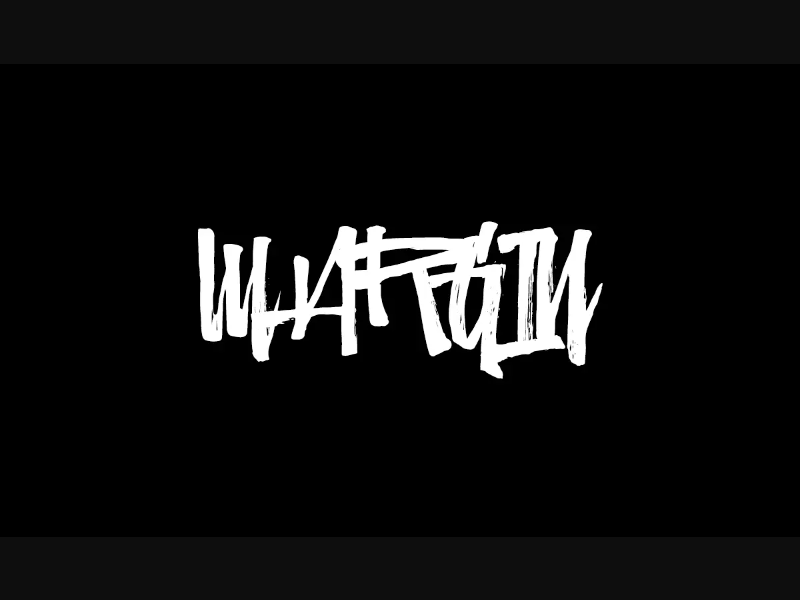

## 先看看 margin {#先看看-margin} 

> **margin（外边距）**：CSS盒模型中的重要组成部分，控制元素边框与其他元素之间的空间距离。理解margin的工作原理是掌握CSS布局的基础。

### margin的四个方向 {#margin的四个方向}

CSS允许我们分别控制元素四个方向的外边距：

| 方向 | 属性 | 描述 |
|------|------|------|
| 上边距 | `margin-top` | 控制元素上方的空间距离 |
| 下边距 | `margin-bottom` | 控制元素下方的空间距离 |
| 左边距 | `margin-left` | 控制元素左侧的空间距离 |
| 右边距 | `margin-right` | 控制元素右侧的空间距离 |

### margin的简写语法 {#margin的简写语法}

为了提高代码效率，CSS提供了margin的简写语法。根据提供的值数量不同，应用规则也不同。下面我们详细介绍四种简写方式：

#### 1. 四个值（上、右、下、左）{#四个值}

当提供四个值时，分别应用于上、右、下、左四个方向，遵循"顺时针"原则。

```css
margin: 10px 20px 30px 40px; /* 上 右 下 左 */
```

**视觉效果：**
<div class="margin-demo">
  <div class="margin-box" style="margin: 10px 20px 30px 40px;">
    <div class="content">内容区域</div>
  </div>
</div>

**值对应表：**

| 方向 | 值 | 说明 |
|------|-----|------|
| 上边距 (margin-top) | 10px | 元素上方的外边距 |
| 右边距 (margin-right) | 20px | 元素右侧的外边距 |
| 下边距 (margin-bottom) | 30px | 元素下方的外边距 |
| 左边距 (margin-left) | 40px | 元素左侧的外边距 |

::: tip
这是最完整的写法，明确指定了四个方向的不同值。当需要四个方向都有不同外边距时使用。
:::

#### 2. 三个值（上、左右、下）{#三个值}

当提供三个值时，第一个值应用于上边距，第二个值应用于左右边距，第三个值应用于下边距。

```css
margin: 10px 20px 30px; /* 上 左右 下 */
```

**等价于：**
```css
margin: 10px 20px 30px 20px; /* 上 右 下 左 */
```

**视觉效果：**
<div class="margin-demo">
  <div class="margin-box" style="margin: 10px 20px 30px 20px;">
    <div class="content">内容区域</div>
  </div>
</div>

**值对应表：**

| 方向 | 值 | 说明 |
|------|-----|------|
| 上边距 (margin-top) | 10px | 元素上方的外边距 |
| 左右边距 (margin-right/left) | 20px | 元素左右两侧的外边距（相同值） |
| 下边距 (margin-bottom) | 30px | 元素下方的外边距 |

::: tip
这种写法适合左右边距相同，但上下边距不同的情况。
:::

#### 3. 两个值（上下、左右）{#两个值}

当提供两个值时，第一个值应用于上下边距，第二个值应用于左右边距。

```css
margin: 10px 20px; /* 上下 左右 */
```

**等价于：**
```css
margin: 10px 20px 10px 20px; /* 上 右 下 左 */
```

**视觉效果：**
<div class="margin-demo">
  <div class="margin-box" style="margin: 10px 20px;">
    <div class="content">内容区域</div>
  </div>
</div>

**值对应表：**

| 方向 | 值 | 说明 |
|------|-----|------|
| 上下边距 (margin-top/bottom) | 10px | 元素上下两侧的外边距（相同值） |
| 左右边距 (margin-right/left) | 20px | 元素左右两侧的外边距（相同值） |

::: tip
这是常用的写法，适合上下边距相同、左右边距相同的情况，常用于块级元素的水平垂直居中。
:::

#### 4. 一个值（四个方向）{#一个值}

当只提供一个值时，该值应用于所有四个方向。

```css
margin: 10px; /* 四个方向相同 */
```

**等价于：**
```css
margin: 10px 10px 10px 10px; /* 上 右 下 左 */
```

**视觉效果：**
<div class="margin-demo">
  <div class="margin-box" style="margin: 10px;">
    <div class="content">内容区域</div>
  </div>
</div>

**值对应表：**

| 方向 | 值 | 说明 |
|------|-----|------|
| 四个方向边距 | 10px | 元素四个方向的外边距（相同值） |

::: tip
这是最简单的写法，适合四个方向需要相同外边距的情况，常用于重置默认外边距或创建均匀间距。
:::

### 简写语法总结 {#简写语法总结}

| 值数量 | 语法格式 | 应用方向 | 等价写法 | 适用场景 |
|--------|----------|----------|----------|----------|
| 4个值 | `margin: 上 右 下 左` | 分别指定四个方向 | - | 四个方向都需要不同值 |
| 3个值 | `margin: 上 左右 下` | 上、左右、下 | `margin: 上 右 下 右` | 左右相同，上下不同 |
| 2个值 | `margin: 上下 左右` | 上下、左右 | `margin: 上 右 上 右` | 上下相同，左右相同 |
| 1个值 | `margin: 全部` | 四个方向 | `margin: 上 上 上 上` | 四个方向都相同 |

<style>
.margin-demo {
  background: #f5f5f5;
  padding: 10px;
  margin: 15px 0;
  border-radius: 4px;
}
.margin-box {
  background: #e8f4fd;
  border: 1px dashed #3498db;
  padding: 10px;
  position: relative;
}
.margin-box .content {
  background: #3498db;
  color: white;
  padding: 8px;
  text-align: center;
  border-radius: 3px;
}
</style>

::: tip
**记忆技巧**：margin的简写遵循"顺时针"原则，从上边距开始，按顺时针方向（上→右→下→左）设置值。当省略某个值时，会使用其对边的值。
:::


## margin负边距 {#margin负边距}
> margin为 **正值** 时，元素在 **文档中所占位置** 是从border之外向四周 **扩展** 的，而为 **负值** 时，则是向内 **收缩** 的(图2)。

1. 正值的时候，元素所占的位置向周围扩散了20px
    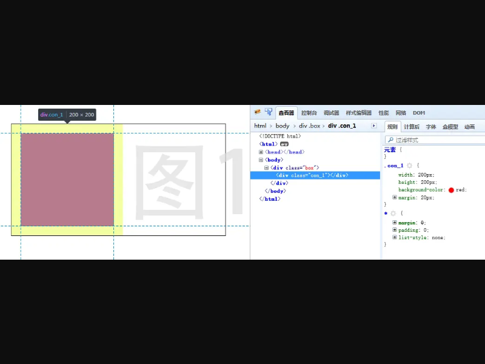

2. 这是负值，可以看到，第二个元素实际 **所占的位置** 已经少了20px，反映在页面就是，元素2向左偏移了20px
    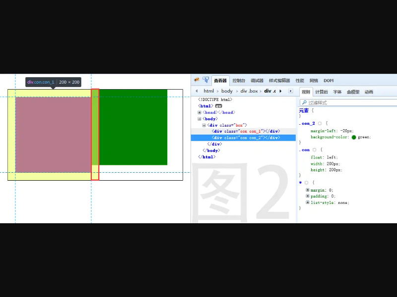

3. 当偏移大于自身宽度的时候，自身将不再 **占有位置** ，后续的元素会无视他（就当没有你这个兄弟！）（图3左负值，图4右负值）
    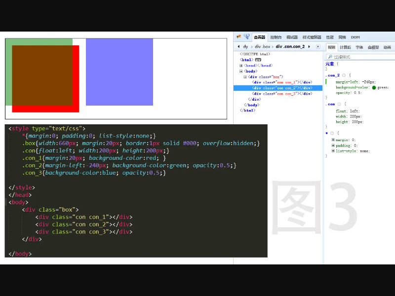
    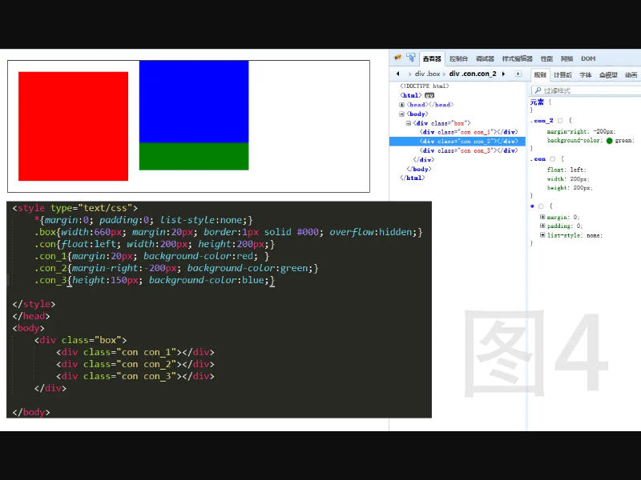

4. 但是，当元素没有固定宽度的时候（或者 **width:auto;**），负值会增加自身宽度！看图，两边露出来了！这是要逆天啊，有木有！
    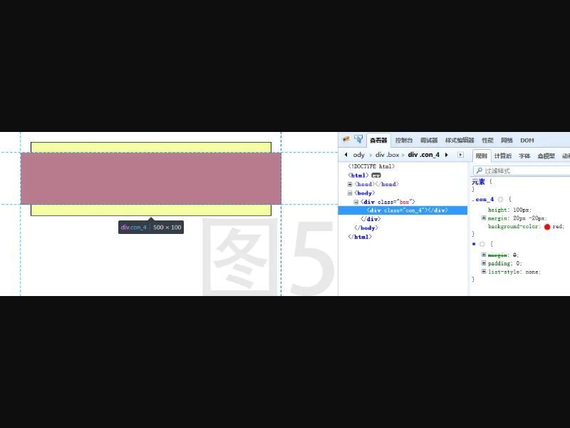

5. 仔细看就会发现，margin只是对元素在 **文档中所占的位置** 产生影响，**正值扩大**，**负值缩小**，记住这点，咱们就可以做很多有意思的东西。


## 实例 {#实例}

下面我们通过几个实际案例来展示margin负值的应用技巧。

### 1. 绝对定位垂直水平居中 {#绝对定位垂直水平居中}

这是一个经典的居中布局技巧，通过绝对定位和margin负值实现元素的完美居中。

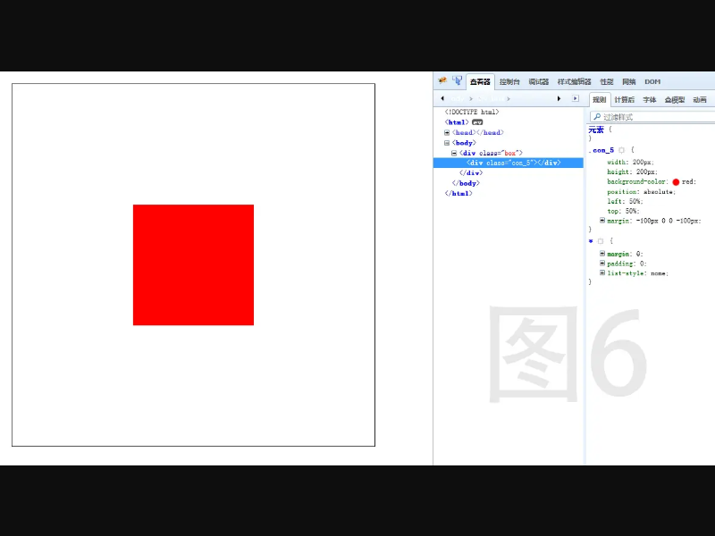

**实现原理：**
- 给元素设置绝对定位，left和top分别为50%
- 然后设置margin-top为负的高度的一半，margin-left为负的宽度的一半
- 这样元素的中心点就会与父容器的中心点重合

```css
<style type="text/css">
  .box{
      width:600px;
      height:600px;
      margin:20px;
      border:1px solid #000;
      position:relative;
  }
  .con{
      width:200px;
      height:200px;
      background-color:red;
      position:absolute;
      left:50%;
      top:50%;
      margin:-100px 0 0 -100px; /* 负的宽高的一半 */
  }
</style>
```

```html
<body>
    <div class="box">
        <div class="con"></div>
    </div>
</body>
```

::: tip
这种方法需要知道元素的精确宽高，对于不确定宽高的元素，可以使用transform: translate(-50%, -50%)来替代。
:::

***

### 2. 列表布局有边框 {#列表布局有边框}

在列表布局中，当每个列表项都有边框时，边框会重叠导致变粗。使用margin负值可以解决这个问题。

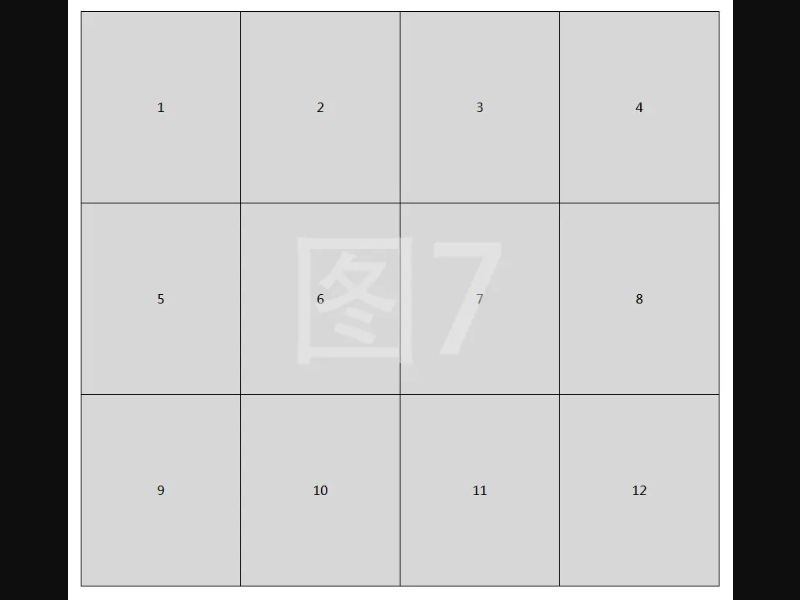

**实现原理：**
- 方法一：上左margin为-1px，配合父级padding上左为1px
- 方法二：右下margin为-1px，配合父级padding-bottom为1px
- 通过相对定位和z-index确保hover状态时完整显示

```css
<style type="text/css">
  .box{
      width:805px;
      margin:20px;
      position:relative;
  }
  .box ul{
      padding:1px 0 0 1px; /* 父级加padding是为了补足子集的偏移 */
      /* 或 padding-bottom:1px; */
      overflow:hidden;
  }
  .box ul li{
      float:left;
      width:200px;
      height:240px;
      text-align:center;
      line-height:240px;
      border:1px solid #000;
      margin:-1px 0 0 -1px; /* 或 margin:0 -1px -1px 0; */
      background-color:#d7d7d7;
      position:relative;
      z-index:0; /* 加定位跟z-index是为了有hover状态的时候完整的显示 */
  }
  .box ul li:hover{
      border-color:red;
      z-index:1;
  }
</style>
```

```html
<body>
    <div class="box">
        <ul>
            <li>1</li>
            <li>2</li>
            <li>3</li>
            <li>4</li>
            <li>5</li>
            <li>6</li>
            <li>7</li>
            <li>8</li>
            <li>9</li>
            <li>10</li>
            <li>11</li>
            <li>12</li>
        </ul>
    </div>
</body>
```

::: tip
这种方法可以避免边框重叠问题，同时保持列表项之间的间距一致。hover时提高z-index可以确保当前项完整显示。
:::

***

### 3. 有间距的列表 {#有间距的列表}

在网格布局中，我们经常需要在列表项之间添加间距，同时保持每行的对齐。margin负值可以完美解决这个问题。

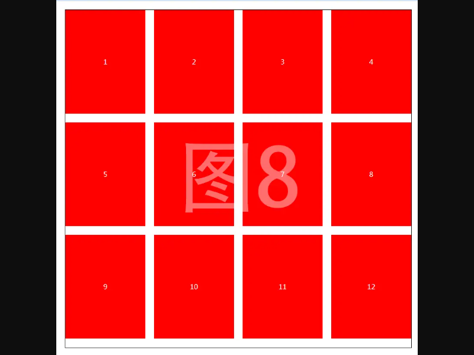

**实现原理：**
- 利用margin负值的特性：当元素没有固定宽度时（width:auto），负值会增加自身宽度
- 给ul设置margin-right为负的间距值，抵消最后一个li的右边距
- 每个li设置右下边距，实现间距效果

```css
<style type="text/css">
.box{
    width:800px;
    margin:20px;
    border:1px solid #000;
    overflow:hidden;
}
.box ul{
    overflow:hidden;
    margin-right:-20px; /* 负的右边距，抵消最后一个li的右边距 */
}
.box ul li{
    float:left;
    width:185px; /* 计算得出：(800-20*3)/4 = 185px */
    height:240px;
    text-align:center;
    line-height:240px;
    color:#fff;
    margin:0 20px 20px 0; /* 右下边距 */
    background-color:red;
}
</style>
```

```html
<body>
  <div class="box">
      <ul>
          <li>1</li>
          <li>2</li>
          <li>3</li>
          <li>4</li>
          <li>5</li>
          <li>6</li>
          <li>7</li>
          <li>8</li>
          <li>9</li>
          <li>10</li>
          <li>11</li>
          <li>12</li>
      </ul>
  </div>
</body>
```

::: tip
这种方法的优点是无需计算每行最后一个元素的特殊样式，通过负margin自动抵消多余的间距，使布局更加灵活。
:::

***

### 4. 右边固定左边自适应布局 {#右边固定左边自适应布局}

在两栏布局中，经常需要一侧固定宽度，另一侧自适应剩余空间。使用margin负值可以实现这种布局。

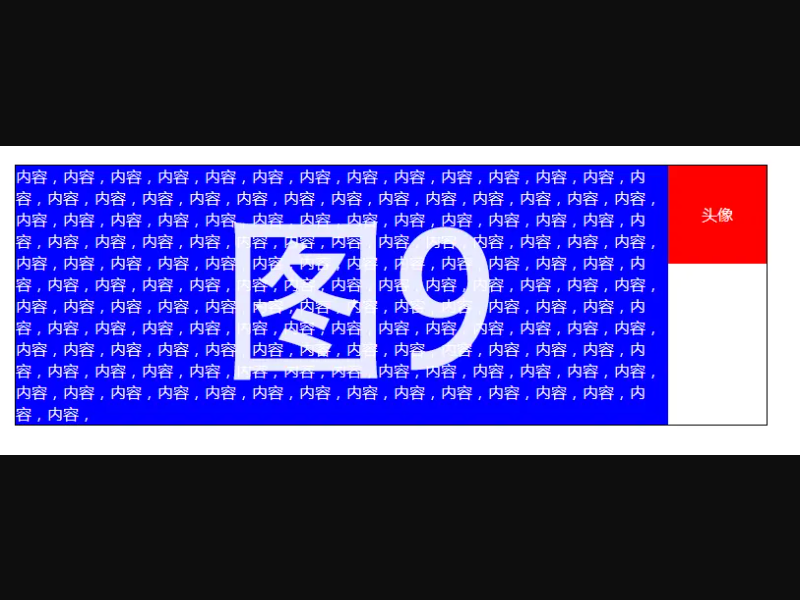

**实现原理：**
- 左边盒子添加父级，宽度100%、左浮动
- 左边内容设置margin-right为右边盒子的宽度
- 右边盒子固定宽度、左浮动，margin-left为负的自身宽度
- 当外层宽度变化时，左边盒子会自适应变化

```css
<style type="text/css">
  .box{
      width:800px;
      margin:20px;
      border:1px solid #000;
      overflow:hidden;
  }
  .box .left_par{
      float:left;
      width:100%;
  }
  .box .left_par .left{
      margin-right:100px; /* 为右侧固定宽度留出空间 */
      background-color:blue;
      color:#fff;
  }
  .box .right{
      float:left;
      width:100px;
      height:100px;
      line-height:100px;
      text-align:center;
      margin-left:-100px; /* 负的自身宽度，拉回到右侧 */
      background-color:red;
      color:#fff;
  }
</style>
```

```html
<body>
  <div class="box">
      <div class="left_par">
          <div class="left">内容 ... 内容</div>
      </div>
      <div class="right">头像</div>
  </div>
</body>
```

::: tip
这种布局方式的优点是结构清晰，兼容性好，可以轻松实现左侧自适应、右侧固定的效果。
:::

***

### 5. 等高列布局 {#等高列布局}

在多栏布局中，让各列高度相等是一个常见需求。使用margin负值可以巧妙实现等高效果。

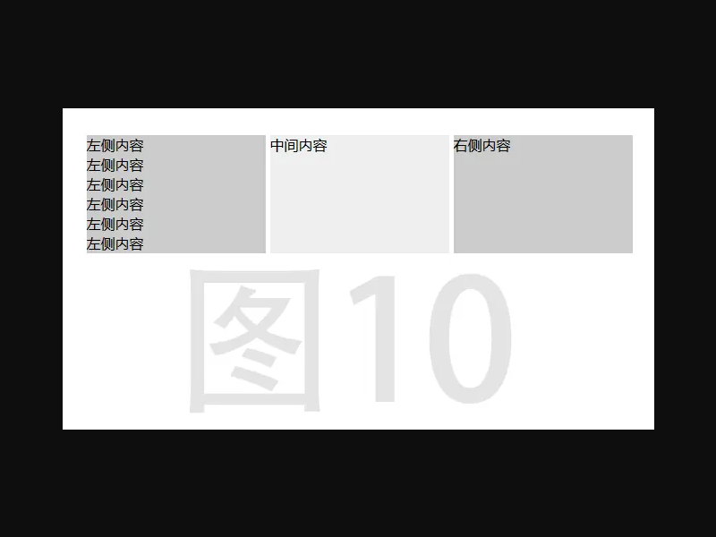

**实现原理：**
- 利用margin的特性：margin只对元素在文档中所占的位置产生影响
- 给每列设置一个很大的padding-bottom值，增加背景高度
- 同时设置等大的负margin-bottom值，将元素占位收缩回去
- 父容器设置overflow:hidden，隐藏超出部分

```css
<style type="text/css">
  .box{
      margin: 40px auto;
      overflow: hidden;
      /* 把内容以外的溢出隐藏，主要是隐藏padding添加的那一部分背景 */
      width: 610px;
  }
  .list {
      background: #ccc;
      float: left;
      width: 200px;
      margin-right: 5px;
      padding-bottom: 99999px; /* 给一个列表不可能达到的高度，主要是为了添加背景 */
      margin-bottom: -99999px; /* 把padding给的高度给收缩回去 */
  }
  #content {
      background: #eee;
  }
  #right {
      margin-right: 0;
  }
</style>
```

```html
<body>
  <div class="box">
      <div id="left" class="list">
          <p>左侧内容</p>
          <p>左侧内容</p>
          <p>左侧内容</p>
          <p>左侧内容</p>
          <p>左侧内容</p>
          <p>左侧内容</p>
      </div>
      <div id="content" class="list">
          <p>中间内容</p>
      </div>
      <div id="right" class="list">
          <p>右侧内容</p>
      </div>
  </div>
</body>
```

::: tip
这种方法的优点是无需JavaScript，纯CSS实现，兼容性好。但要注意，如果列内容过多，可能会被截断。
:::

*************************

> 先这么多，待续...


_有不明白的可以留言☺_