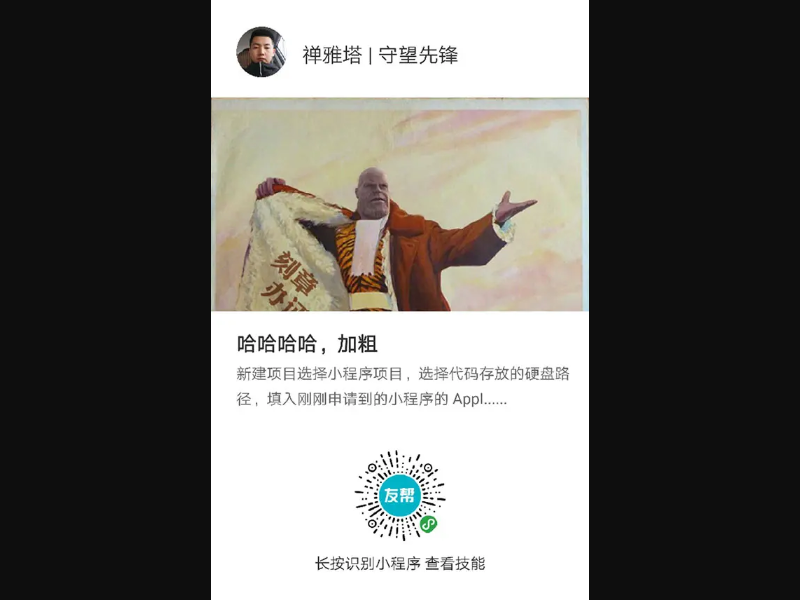
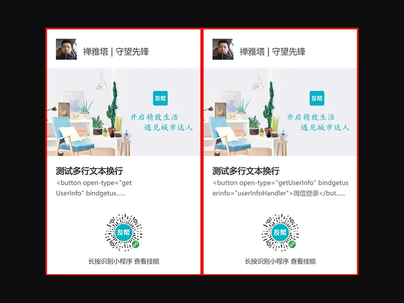

# 小程序canvas文本绘制自动换行、字体加粗简单实现

## 直接上代码
```
    Page({
        /**
         * 渲染文字
         *
         * @param {Object} obj
         */
        drawText: function (obj) {
            console.log('渲染文字')
            this.ctx.save();
            this.ctx.setFillStyle(obj.color);
            this.ctx.setFontSize(obj.size);
            this.ctx.setTextAlign(obj.align);
            this.ctx.setTextBaseline(obj.baseline);
            if (obj.bold) {
                console.log('字体加粗')
                this.ctx.fillText(obj.text, obj.x, obj.y - 0.5);
                this.ctx.fillText(obj.text, obj.x - 0.5, obj.y);
            }
            this.ctx.fillText(obj.text, obj.x, obj.y);
            if (obj.bold) {
                this.ctx.fillText(obj.text, obj.x, obj.y + 0.5);
                this.ctx.fillText(obj.text, obj.x + 0.5, obj.y);
            }
            this.ctx.restore();
        },

        /**
         * 文本换行
         *
         * @param {Object} obj
         */
        textWrap: function (obj) {
            console.log('文本换行')
            var td = Math.ceil(obj.width / (obj.size));
            var tr = Math.ceil(obj.text.length / td);
            for (var i = 0; i < tr; i++) {
                var txt = {
                    x: obj.x,
                    y: obj.y + (i * obj.height),
                    color: obj.color,
                    size: obj.size,
                    align: obj.align,
                    baseline: obj.baseline,
                    text: obj.text.substring(i * td, (i + 1) * td),
                    bold: obj.bold
                };
                if (i < obj.line) {
                    if (i == obj.line-1){
                        txt.text = txt.text.substring(0, txt.text.length - 3) +'......';
                    }
                    this.drawText(txt);
                }
            }
        },
    })
```
## 参数说明
##### drawText：
```
    let title = {
        x: 40,
        y: 524,
        color: '#333333',
        size: 32,
        align: 'left',
        baseline: 'top',
        text: '哈哈哈哈，加粗',
        bold: true
    };
    this.drawText(title);
```
| 参数 | 类型 | 说明 | 
| - | - | - | 
| [x](https://developers.weixin.qq.com/miniprogram/dev/api/canvas/fill-text.html) | Number | 绘制文本的左上角x坐标位置 | 
| [y](https://developers.weixin.qq.com/miniprogram/dev/api/canvas/fill-text.html) | Number | 绘制文本的左上角y坐标位置 | 
| [color](https://developers.weixin.qq.com/miniprogram/dev/api/canvas/set-fill-style.html) | Color | 字体的颜色 | 
| [size](https://developers.weixin.qq.com/miniprogram/dev/api/canvas/set-font-size.html) | Number | 字体的字号 | 
| [align](https://developers.weixin.qq.com/miniprogram/dev/api/canvas/set-text-align.html) | String | 文字的对齐，可选值 'left'、'center'、'right' | 
| [baseline](https://developers.weixin.qq.com/miniprogram/dev/api/canvas/set-text-baseline.html) | String | 设置文字的水平对齐，可选值 'top'、'bottom'、'middle'、'normal' | 
| [text](https://developers.weixin.qq.com/miniprogram/dev/api/canvas/fill-text.html) | String | 在画布上绘制被填充的文本。 | 
| bold | Boolean | 是否加粗 | 

##### textWrap:
```
    let details = {
        x: 40,
        y: 576,
        width: 520,
        height: 40,
        line: 2,
        color: '#666666',
        size: 24,
        align: 'left',
        baseline: 'top',
        text: '新建项目选择小程序项目，选择代码存放的硬盘路径，填入刚刚申请到的小程序的 AppID，给你的项目起一个好听的名字。',
        bold: false
    }
    this.drawText(title);
```
| 参数 | 类型 | 说明 | 
| - | - | - | 
| [x](https://developers.weixin.qq.com/miniprogram/dev/api/canvas/fill-text.html) | Number | 绘制文本的左上角x坐标位置 | 
| [y](https://developers.weixin.qq.com/miniprogram/dev/api/canvas/fill-text.html) | Number | 绘制文本的左上角y坐标位置 | 
| width | Number | 文本区域宽度 | 
| height | Number | 文本行高 | 
| line | Number | 最多显示几行 | 
| [color](https://developers.weixin.qq.com/miniprogram/dev/api/canvas/set-fill-style.html) | Color | 字体的颜色 | 
| [size](https://developers.weixin.qq.com/miniprogram/dev/api/canvas/set-font-size.html) | Number | 字体的字号 | 
| [align](https://developers.weixin.qq.com/miniprogram/dev/api/canvas/set-text-align.html) | String | 文字的对齐，可选值 'left'、'center'、'right' | 
| [baseline](https://developers.weixin.qq.com/miniprogram/dev/api/canvas/set-text-baseline.html) | String | 设置文字的水平对齐，可选值 'top'、'bottom'、'middle'、'normal' | 
| [text](https://developers.weixin.qq.com/miniprogram/dev/api/canvas/fill-text.html) | String | 在画布上绘制被填充的文本。 | 
| bold | Boolean | 是否加粗 | 

## 效果


## 注意，以上是简单的实现，所以如果有英文会计算不精确，解决方法如下：
优化原理：通过基础库 1.9.90 开始支持的[measureText](https://developers.weixin.qq.com/miniprogram/dev/api/canvas/measure-text.html)接口返回的文本宽度，把每个字符宽度不断累加，精确计算在哪个位置应该换行去实现这个功能。
```
    /**
     * 获取文本折行
     * @param {Object} obj
     * @return {Array} arrTr
     */
    getTextLine: function(obj){
        this.ctx.setFontSize(obj.size);
        let arrText = obj.text.split('');
        let line = '';
        let arrTr = [];
        for (let i = 0; i < arrText.length; i++) {
            var testLine = line + arrText[i];
            var metrics = this.ctx.measureText(testLine);
            var width = metrics.width;
            if (width > obj.width && i > 0) {
                arrTr.push(line);
                line = arrText[i];
            } else {
                line = testLine;
            }
            if (i == arrText.length - 1) {
                arrTr.push(line);
            }
        }
        return arrTr;
    },
```
| 参数 | 类型 | 说明 | 
| - | - | - | 
| width | Number | 文本区域宽度 | 
| [size](https://developers.weixin.qq.com/miniprogram/dev/api/canvas/set-font-size.html) | Number | 字体的字号 | 
| [text](https://developers.weixin.qq.com/miniprogram/dev/api/canvas/fill-text.html) | String | 在画布上绘制被填充的文本。 | 

之后，textWrap方法改为：
```
    /**
     * 文本换行
     *
     * @param {Object} obj
     */
    textWrap: function (obj) {
        console.log('文本换行')
        let tr = this.getTextLine(obj);
        for (let i = 0; i < tr.length; i++) {
            if (i < obj.line){
                let txt = {
                    x: obj.x,
                    y: obj.y + (i * obj.height),
                    color: obj.color,
                    size: obj.size,
                    align: obj.align,
                    baseline: obj.baseline,
                    text: tr[i],
                    bold: obj.bold
                };
                if (i == obj.line - 1) {
                    txt.text = txt.text.substring(0, txt.text.length - 3) + '......';
                }
                this.drawText(txt);
            }
        }
    },
```
## 效果


___注：在开发工具截取圆形会失效，这张是开发者工具生成的，第一张是真机生成的。___

#### 优化前后对比



## 补充，字体加粗
基础库 1.9.90 开始支持设置字体样式 [canvasContext.font](https://developers.weixin.qq.com/miniprogram/dev/api/canvas/font.html)

    canvasContext.font = value

###### value 支持的属性有：
| 属性 | 说明 |
| - | - |
| style | 字体样式。仅支持 italic, oblique, normal |
| weight | 字体粗细。仅支持 normal, bold |
| size | 字体大小 |
| family | 字体族名。注意确认各平台所支持的字体 |

加粗如果是不需要兼容的话直接用这个属性就好了，如果需要兼容低版本库，就用重复渲染的方式，希望小程序后续支持多行文本换行吧~

## 优化待续...

