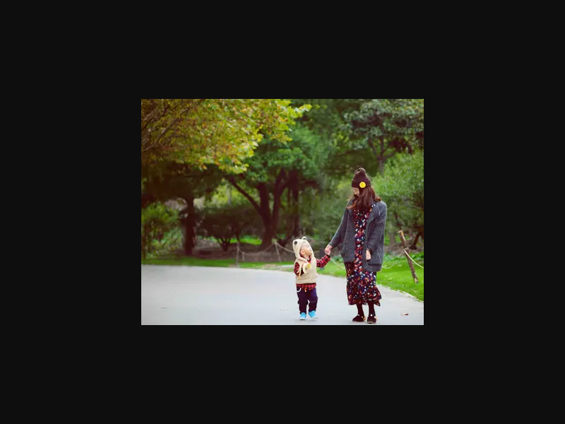

# 小程序封面-七牛图片裁剪
#### 七牛API
使用七牛的 [图片高级处理(imageMogr2 )](https://developer.qiniu.com/dora/manual/1270/the-advanced-treatment-of-images-imagemogr2) 接口去实现

#### 封面在 ```imageMogr2 ```用到的参数
| 参数 | 说明 | 
| - | - | 
| ```auto-orient``` | 建议放在首位，根据原图EXIF信息自动旋正，便于后续处理。 | 
| ```thumbnail``` | 缩放，参看[缩放操作参数表](https://developer.qiniu.com/dora/manual/1270/the-advanced-treatment-of-images-imagemogr2#imagemogr2-thumbnail-spec)，默认为不缩放。| 
| ```gravity``` | 裁剪偏移，参看[图片处理重心参数表](https://developer.qiniu.com/dora/manual/1270/the-advanced-treatment-of-images-imagemogr2#imagemogr2-anchor-spec)，目前在imageMogr2中只影响其后的裁剪偏移参数，默认为左上角(NorthWest)。| 
| ```crop``` | 裁剪，参看[裁剪操作参数表](https://developer.qiniu.com/dora/manual/1270/the-advanced-treatment-of-images-imagemogr2#imagemogr2-crop-size-spec)，默认为不裁剪。 | 
| ```format``` | 图片格式。支持jpg、gif、png、webp等，默认为原图格式，参看[支持转换的图片格式](http://www.imagemagick.org/script/formats.php)。| 
| ```quality``` | 新图的图片质量。取值范围为1-100，默认75。指定值后面可以增加 `!`，表示强制使用指定值，如：`100!`。支持图片类型：jpg。| 
| ```size-limit``` | 限制图片转换后的大小，支持以兆字节和千字节为单位的图片。~~对于所有图片格式，若在尾部加上```!```，表示用转换后的图片大小与原图大小做比较，如果转换后的图片比原图小，则返回转换后的图片，否则返回原图。~~```注：如果加了感叹号，小于指定大小的图会返回原图，导致裁剪失败``` | 

#### 实例
因为小程序需要 ```5:4``` 的封面图，且图片不能大于```128k```，而我们的封面图都是 ```16:9```，所以如下：
~~```?imageMogr2/auto-orient/thumbnail/x320/gravity/Center/crop/400x320/format/jpg/quality/100/size-limit/120k!```~~  ```2019-04-01 delete```
```
?imageMogr2/auto-orient/thumbnail/x320/gravity/Center/crop/400x320/format/jpg/quality/100/size-limit/120k
```
- ```/thumbnail/x320```：指定高度为320，宽度自适应
- ```/gravity/Center```：后续裁剪居中裁剪
- ```/crop/400x320```：裁剪大小400x320(5:4)
- ```/format/jpg```：图片格式取jpg
- ```quality/100```：图片质量100%，不然有可能会模糊
- ~~```size-limit/120k!```：限制图片转换后的最大为120k~~ ```2019-04-01 delete```
- ```size-limit/120k```：限制图片转换后的最大为120k ```2019-04-01 add```


#### 效果
转换前：
  
转换后：
  

#### 最后
因为我们的比例为 ```16:9``` ，所以我只是限制了高度，如果比例不是宽比高大，那么需要去限制宽，其他的需求自行参考文档去实现，有时间我再试试通用的~

#### 2019-01-08 完善
为了解决不同的宽高比，查看文档之后发现了 [```/thumbnail/!<Width>x<Height>r```](https://developer.qiniu.com/dora/manual/1270/the-advanced-treatment-of-images-imagemogr2#imagemogr2-thumbnail-spec)，只需改变 ```thumbnail``` 属性值为 ```!400x320r```就可以了，如下：
~~```?imageMogr2/auto-orient/thumbnail/!400x320r/gravity/Center/crop/400x320/format/jpg/quality/100/size-limit/120k!```~~ ```2019-04-01 delete```
```
?imageMogr2/auto-orient/thumbnail/!400x320r/gravity/Center/crop/400x320/format/jpg/quality/100/size-limit/120k
```
- ```/thumbnail/x320```：按照```400x320(5:4)```等比缩放，比例值为宽缩放比和高缩放比的较大值

转换前：
  

转换后：


#### 2019-04-01 小图不裁剪bug处理
发现一个```192*192```大小的图没有放大到```400*320```，经检查发现是```size-limit/120k!```导致，细看文档会发现：
> 对于所有图片格式，若在尾部加上!，表示用转换后的图片大小与原图大小做比较，如果转换后的图片比原图小，则返回转换后的图片，否则返回原图。

所以如果图片原大小小于```120k```，会直接返回原图，之前的所有指令都失效，导致裁剪失败，所以直接去掉 ```!``` 即可。


  