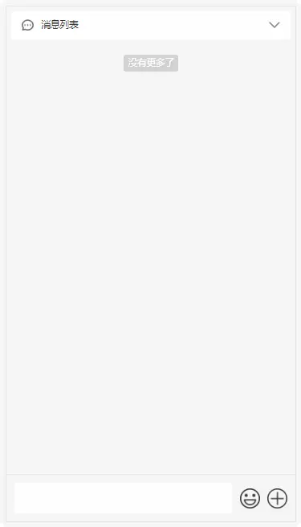

# 手机端聊天框实现图片表情连续插入

### 效果
直接显示表情，且可以在文字中间插入表情，包括换行显示。
  

### 难点
要想实现文字图片混排，需要用到富文本编辑技术（即添加```contenteditable="true" ```属性），但是使用```document.execCommand```命令会让文本框会获得焦点，使表情选择框隐藏，如果在插入之后使文本框失去焦点，在苹果手机会因为软键盘弹出收起而导致页面跳动，为了解决这个问题，只能抛弃```execCommand```命令，把图片直接插入到指定位置。
_ps：富文本编辑器会单独写一篇记录，聊天框使用的只是一个简易版富文本编辑器_

### 需要用到的API
- [contenteditable](https://developer.mozilla.org/zh-CN/docs/Web/API/HTMLElement/contentEditable) 设计模式，设置元素是否是可编辑
- [document.execCommand](https://developer.mozilla.org/zh-CN/docs/Web/API/Document/execCommand) 当一个HTML文档切换到设计模式时，允许运行命令来操纵[可编辑内容区域](https://developer.mozilla.org/zh-CN/docs/Web/HTML/Global_attributes/contenteditable)的元素

- [Window.getSelection()](https://developer.mozilla.org/zh-CN/docs/Web/API/Window/getSelection) 获取用户选择的文本范围或光标的当前位置
- [Range](https://developer.mozilla.org/zh-CN/docs/Web/API/Range) 表示一个包含节点与文本节点的一部分的文档片段
- [Node.insertBefore()](https://developer.mozilla.org/zh-CN/docs/Web/API/Node/insertBefore) 在一个节点之前插入一个拥有指定父节点的子节点
- [Node.appendChild()](https://developer.mozilla.org/zh-CN/docs/Web/API/Node/appendChild) 将一个节点附加到指定父节点的子节点列表的末尾处
- [Text.splitText()](https://developer.mozilla.org/zh-CN/docs/Web/API/Text/splitText) 根据指定的偏移量将一个 [`Text`](https://developer.mozilla.org/zh-CN/docs/Web/API/Text) 节点分割成前后两个独立的兄弟节点
- [Node.nextSibling](https://developer.mozilla.org/zh-CN/docs/Web/API/Node/nextSibling) 返回其父节点的 [`childNodes`](https://developer.mozilla.org/zh-CN/docs/Web/API/Node/childNodes) 列表中紧跟在其后面的节点
- [element.onpaste](https://developer.mozilla.org/zh-CN/docs/Web/API/HTMLElement/onpaste) 粘贴事件（需要格式化粘贴的内容，不然会有html）

### 实现
本示例使用的`vue`，如是其他请自行转换，关键代码都是原生js实现。

##### html
```
<div>
    <div class="editorBox">
		<!-- 输入框 -->
        <div
            class="editor" 
            ref="chatTextarea"
            id="chatTextarea"
            contenteditable="true" 
            @paste="editorPaste"
            @blur="editorBlur" 
            @focus="editorFocus" 
            @input="editorInput">
        </div>
        <!-- 表情开关 -->
        <div class="icon" @click="openEmoticon">表情</div>
        <!-- 发送按钮 -->
        <div class="send" @click="submitSend">发送</div>
    </div>
    
    <!-- 表情区域 -->
    <div class="emoticonBox" v-show="emoticonShow">
        
    </div>
</div>


```
##### js
```
// ...
export default {
	data() {
        return {
        	// ...
        	emoticonShow: false,
        	emojiData: {},	// 自己的表情数据
        	currentSelection: {
                startContainer: null,
                startOffset: 0,
                endContainer: null,
                endOffset: 0
            },
        }
    },
    mounted() {
    	// ...
    	this.init();
    },
	methods: {
		// 初始化编辑器
        init(){
        	const editor = this.$refs.chatTextarea;
            // 光标位置为开头
            this.currentSelection = {
            	startContainer: editor,
            	startOffset: 0,
            	endContainer: editor,
            	endOffset: 0
            }
            // 设置光标位置
            this.restorerange();
        },
        // 备份当前光标位置
        backuprange() {
            let selection = window.getSelection();
            if (selection.rangeCount > 0) {
                let range = selection.getRangeAt(0);
                this.currentSelection = {
                    startContainer: range.startContainer,
                    startOffset: range.startOffset,
                    endContainer: range.endContainer,
                    endOffset: range.endOffset
                };
            }
        },
        // 设置光标位置
        restorerange() {
            if(this.currentSelection){
                let selection = window.getSelection();
                selection.removeAllRanges();
                let range = document.createRange();
                range.setStart(this.currentSelection.startContainer, this.currentSelection.startOffset);
                range.setEnd(this.currentSelection.endContainer, this.currentSelection.endOffset);
                // 向选区中添加一个区域
                selection.addRange(range);
            }
        },
        // 插入text文本
        inserText(text) {
        	// 插入前先恢复上次的光标位置
            this.restorerange();
            document.execCommand('insertText', false, text);
        },
        // 插入html片段
        insertHTML(html) {
        	// 插入前先恢复上次的光标位置
            this.restorerange();
            document.execCommand('insertHTML', false, html);
        },

        // 粘贴事件
		editorPaste(e){
			// 阻止默认事件
            e.preventDefault();
            const clp = e.clipboardData || e.originalEvent && e.originalEvent.clipboardData;
            // 获取纯文本与富文本
            let plainText,htmlText;
            if (clp == null) {
                plainText = window.clipboardData && window.clipboardData.getData('text');
            } else {
                plainText = clp.getData('text/plain');
                htmlText = clp.getData('text/html');
            }
            // 某些ios手机获取不到富文本，需要处理一下
            if (!htmlText && plainText) {
                htmlText = '<div>' + plainText.replace(/[\n\r]|[\r\n]|[\r]|[\n]/g,'</div><div>') + '</div>';
            }
            if (!htmlText) {
                return;
            }
            // 聊天框只使用纯文本，富文本编辑器会用到html
            this.inserText(plainText);

            // 备份当前光标
            this.backuprange();
        },
        // 失去焦点
        editorBlur(){
        	// 备份当前光标位置
            this.backuprange();
        },
        // 获取焦点
        editorFocus(){
            // 处理获取到焦点的逻辑
        	// ...
        	// 隐藏表情区域
            this.emoticonShow = false;
        },
        // 输入中
        editorInput(){
        	// 备份当前光标位置
            this.backuprange();
        },

        // 打开表情
        openEmoticon(){
            this.emoticonShow = true;
        },

        // 选择插入表情/图片
        chooseEmoji(key){
            const node = new Image();
            node.src = '你需要插入的图片地址';
            if(this.currentSelection.startContainer.nodeType==3){
                // 如果是文本节点，拆分文字
                const newNode = this.currentSelection.startContainer.splitText(this.currentSelection.startOffset);
                // 设置光标开始节点为拆分之后节点的父级节点
                this.currentSelection.startContainer = newNode.parentNode;
                // 在拆分后得到的节点之前插入图片
                this.currentSelection.startContainer.insertBefore(node, newNode);
            }else{
                // 非文本节点
                if(this.currentSelection.startContainer.childNodes.length){
                	// 如果光标开始节点下有子级，获取到光标位置的节点
                    const beforeNode = this.currentSelection.startContainer.childNodes[this.currentSelection.startOffset];
                    // 插入
                    this.currentSelection.startContainer.insertBefore(node, beforeNode);
                }else{
                	// 如果光标开始节点下没有子级，直接插入
                    this.currentSelection.startContainer.appendChild(node);
                }
            }

            // 获取插入的节点所在父级下的位置
            const index = Array.from(this.currentSelection.startContainer.childNodes).indexOf(node);
            this.currentSelection.startOffset = index+1;
            this.currentSelection.endOffset = index+1;
            
            // 视图滚动带完全显示出来
            node.scrollIntoView(false)
        },

        // 发送
        submitSend(){
            const html = this.$refs.chatTextarea.innerHTML;
            // 发送逻辑
        },
	}
}
```

##### css
按照设计稿自行添加


## 最后
主要逻辑都有注释，有更好的实现方式或有问题欢迎留言，我会持续更新~