# 解密 Iconfont


## 什么是 iconfont？

> **icon font** ，图标字体，也叫字体图标，顾名思义，就是字体做的图标。受到近些年 **扁平化设计** 的影响，越来越多的图标都开始使用 **icon font**
 
 **优点：**
 
 1. 自由的变化大小，且不会模糊
 
 2. 比图片小，加载快
 
 3. 可以任意改变颜色
 
 *********

 **缺点：**
 
 1. 只能被渲染成单色或者CSS3的渐变色
 
 2. 创作自已的字体图标很费时间，重构人员后期维护的成本偏高。
 

<br />
## 了解 iconfont 之前我们先看看 WebFont

> 我们都知道，在网页制作中，会经常用到不同的字体，常用的有 **微软雅黑**、**宋体**、**Aria** 等等。在我们写css的样式的时候，通过 **font-family** 可以指定元素的字体名称。
> 
> 如果是 **特殊字体** ，因为我们的电脑没有安装那个字体，所以在网页中显示不出来，所以我们通过 **@font-face** 来引入特殊字体。

看看 **@font-face** 的语法规则：

    @font-face {
        font-family: <YourWebFontName>;
        src: <source> [<format>][,<source> [<format>]]*;
        [font-weight: <weight>];
        [font-style: <style>];
    }

**取值说明：**
 
* YourWebFontName：字体名称，他将被引用到元素中的 **font-family** 上
 
* source：字体的存放路径，跟css引用图片一样；
 
* format：字体的格式，主要用来帮助浏览器识别，其值主要有以下几种类型：**truetype** , **opentype** , **truetype-aat** , **embedded-opentype** , **svg** 等；
 
* weight和style：这两个值大家一定很熟悉，weight定义字体是否为粗体，style主要定义字体样式，如斜体。
 

**关于 @font-face 的浏览器兼容性：**
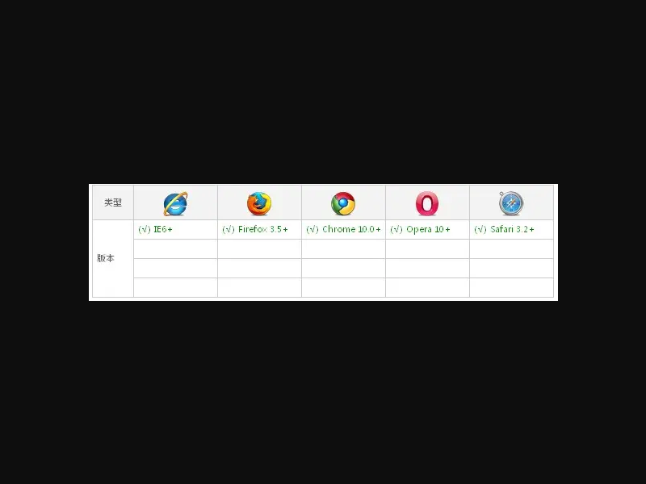


#### 其实 **@font-face** 这个功能早在IE4就支持了，我们看看兼容写法：

    @font-face {
        font-family: 'YourWebFontName';
        src: url('YourWebFontName.eot'); /* IE9 Compat Modes */
        src: url('YourWebFontName.eot?#iefix') format('embedded-opentype'), /* IE6-IE8 */
             url('YourWebFontName.woff') format('woff'), /* Modern Browsers */
             url('YourWebFontName.ttf')  format('truetype'), /* Safari, Android, iOS */
             url('YourWebFontName.svg#YourWebFontName') format('svg'); /* Legacy iOS */
    }

* **TrueType(.ttf)** 格式：
 **.ttf** 字体是 **Windows** 和 **Mac** 的最常见的字体，是一种 **RAW** 格式，因此他不为网站优化,支持这种字体的浏览器有 **【IE9+ , Firefox3.5+ , Chrome4+ , Safari3+ , Opera10+ , iOS Mobile Safari4.2+】**
 
* **OpenType(.otf)** 格式：
**.otf** 字体被认为是一种原始的字体格式，其内置在 **TureType** 的基础上，所以也提供了更多的功能,支持这种字体的浏览器有**【Firefox3.5+ , Chrome4.0+ , Safari3.1+ , Opera10.0+ , iOS Mobile Safari4.2+】** 

* **Web Open Font Format(.woff)** 格式：
**.woff** 字体是Web字体中最佳格式，他是一个开放的 **TrueType/OpenType** 的压缩版本，同时也支持元数据包的分离,支持这种字体的浏览器有**【IE9+ , Firefox3.5+ , Chrome6+ , Safari3.6+ , Opera11.1+】** 

* **Embedded Open Type(.eot)** 格式：
**.eot** 字体是IE专用字体，可以从**TrueType** 创建此格式字体,支持这种字体的浏览器有 **【IE4+】**

*******************

>  **WebFont** 技术可以让网页使用在线字体，在国外，**WebFont** 已经非常流行了，大量的网站使用了 **WebFont** 技术，而业界大佬 Google 也顺势推出的免费 **WebFont** 云托管服务，这一切均带动了国外字体制作行业的高速发展。
> 
> 为什么是国外呢，那是因为中文字体比较尴尬，英文字体只有26个字母，一套字体不过几十 **KB** ，而汉字却有数万个，导致字体文件通常有好几 **MB** 大小，再加上国内的网络环境，显然不现实。
> 
> 所以中文的 **特殊字体** 必须经过压缩才能使用，怎么压缩呢，请看 **腾讯ISUX** 开发的 [中文字体压缩器--字蛛（FontSpider）](http://font-spider.org/) 。
> 
> 因为这篇主要讲的是 **iconfont** ，所以我就不详细的讲 [字蛛](http://font-spider.org/) 的使用方法了， [字蛛](http://font-spider.org/) 官网很详细。
> 


## 说说 iconfont 的原理
> 每种字体在相同的字都是不一样的，比如 **宋体** 跟 **微软雅黑** ，相同的字 ，由于调用的不同的字体，浏览器显示明显是有区别的。
> 
> 在我们还不识字的时候，每个字都是一个图案，所以老师会告诉你哪个图案念什么 ，是什么字，**iconfont** 同理，我认为 **三角形** 是 **a**，那对于我来说，只要是 **a** ，就应该是个 **三角形**。
> 
> 在电脑上，我给电脑规定 **a** 的样子是个 **三角形**，那么当显示 **a** 的时候，他就显示个三角形。
> 
> 当我把网页上的所有图标都对应一个字符的时候，你在代码里输入某个字符，那这个字符就显示你规定的形状，这就是 **iconfont** 图标。
> 
> 把所有的图标都放在一个字体里面，就是一个字体库了，然后按照正常字体库（本来就是正常的字体库）调用就行了。
> 


## iconfont 的制作

> 最初制作 **iconfont** 都是在字体制作软件里面制作，比如 **FontLab**、**TypeTool**、**FontCreator**之类的专业软件，我最开始的时候是使用的 **FontCreator** 来制作，我现在简单的给大家演示一下。

1. 先新建一个字体文件

  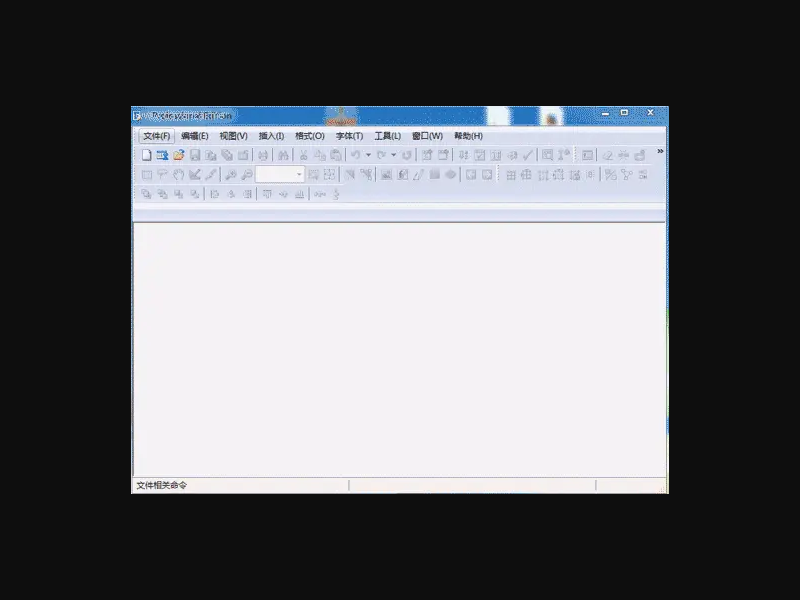

2. 随便打开一个字体，选中某个字符，**ctrl+c** 复制，然后选中新建的字体的某个字符，**ctrl+v** 粘贴。右键这个字符，**编辑**。

  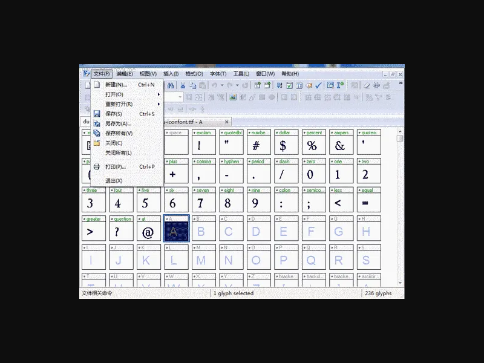

3. 我们可以大概知道字体区域，我们做的图标也大概在这个区域

  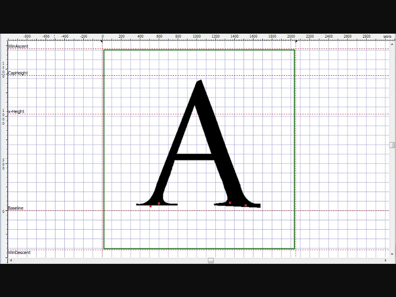

4. 随便找张图，比如中国移动的图标

  

5. 把这张图导入到刚在的字体中

  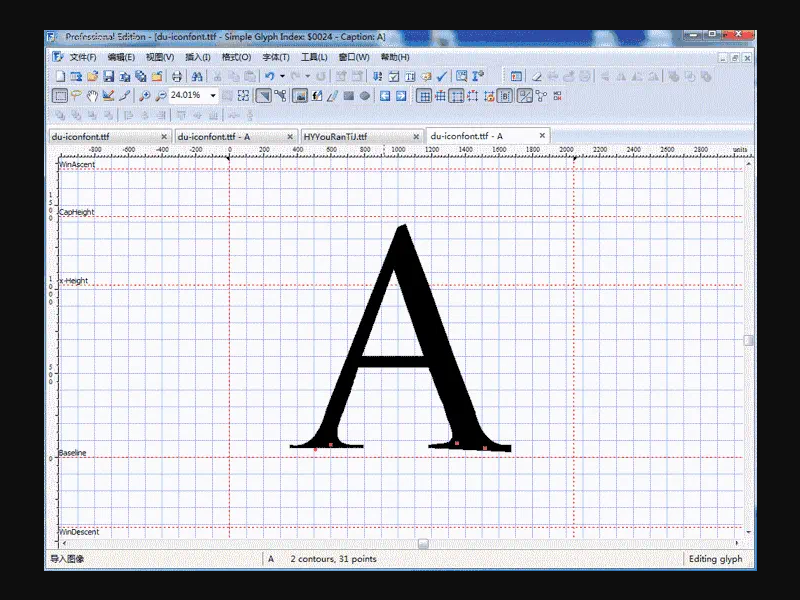

6. 调整图片的位置，把原先的图形选中，**delete** 删掉，保存

  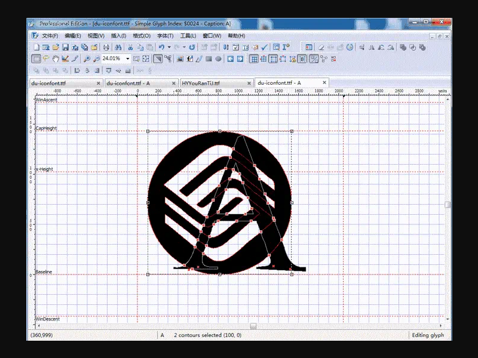

7. 看看在网页中

  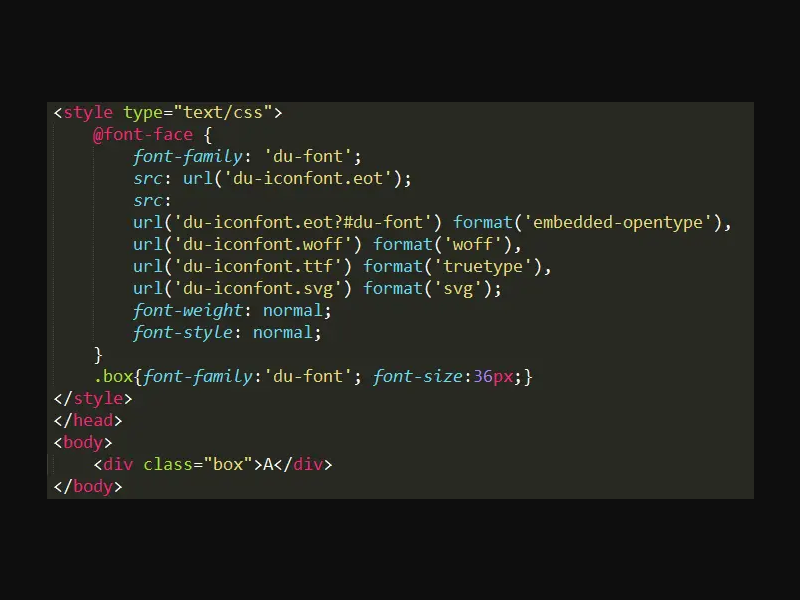
  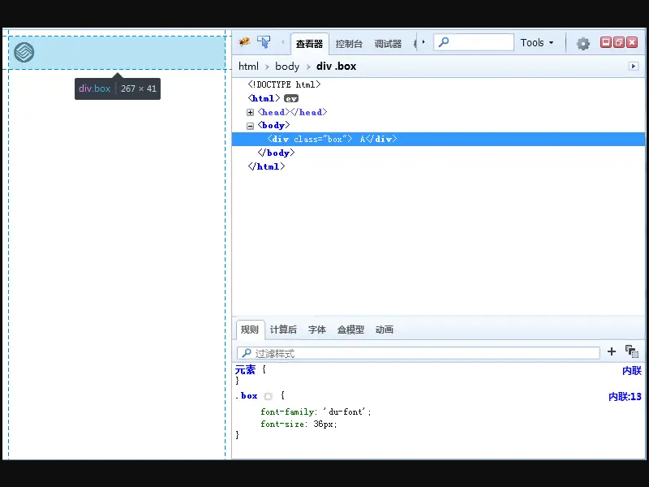

8. 一个 **icon** 就做好了，然后其他的也是这种方法

##### 因为为了兼容，必须转换成四种格式，本地转换的工具很少，只能在在线转，这是国外的几个地址：
- [fontsquirrel](https://www.fontsquirrel.com/tools/webfont-generator)

- [freefontconverter](http://www.freefontconverter.com/)

- [font2web](http://www.font2web.com/)

> 这样用字体软件做图标会很麻烦，有没有简单的办法呢？答案是肯定的，由 **阿里妈妈UED** 开发的 [Iconfont-阿里巴巴矢量图标库](http://www.iconfont.cn/) 会帮大家快速的生成 **iconfont**。具体的制作方法请查看 [Iconfont.cn](http://www.iconfont.cn/) 提供的 [图标制作说明](http://www.iconfont.cn/help/iconmake.html?spm=a313x.7781069.0.0.DY1v1s)。
> 
> [Iconfont.cn](http://www.iconfont.cn/) 上有大量的 **iconfont** 图标，可以快速的搜索，然后加到自己的项目中，网站可以用你的 **新浪微博** 登录。
> 


## 扒别的网站的字体文件
> 在火狐里打开你要扒的网站，以天猫为例：

1. 打开浏览器自带的 **firebug** ，用箭头指到那个图标

  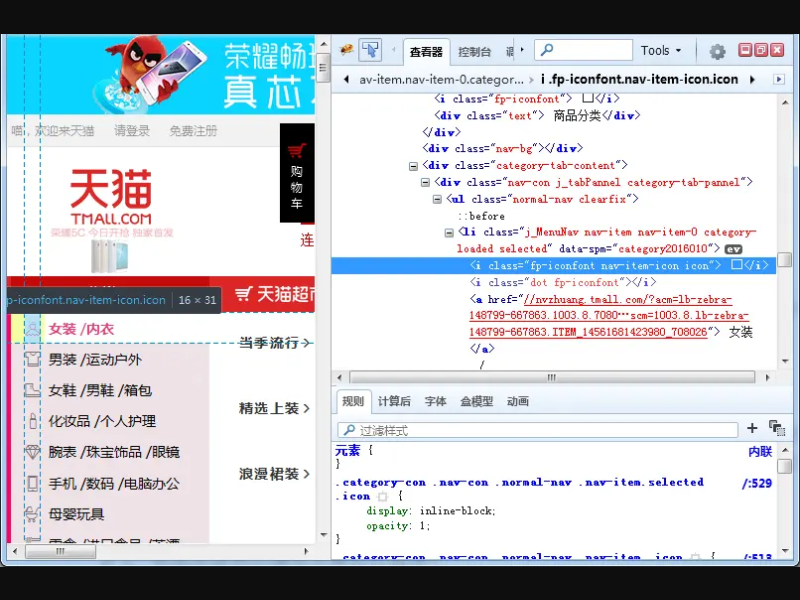

2. 选择字体，然后选择远程的那个地址，**ctrl+a** 全选，**ctrl+c** 复制

  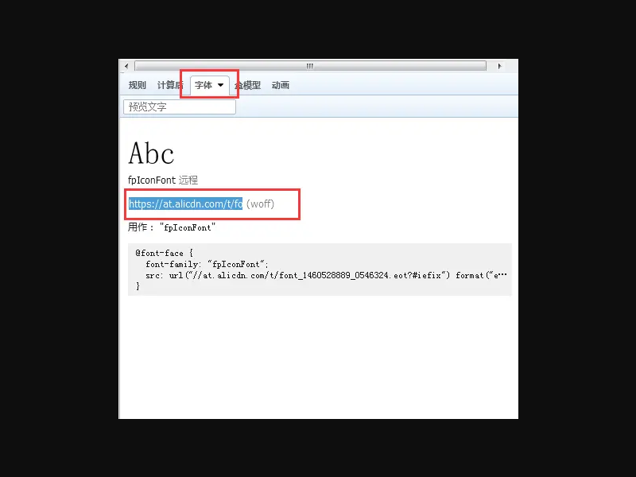

3. 把复制的地址粘贴到浏览器地址栏，然后把 **.woff** 改为 **.ttf** ，回车

  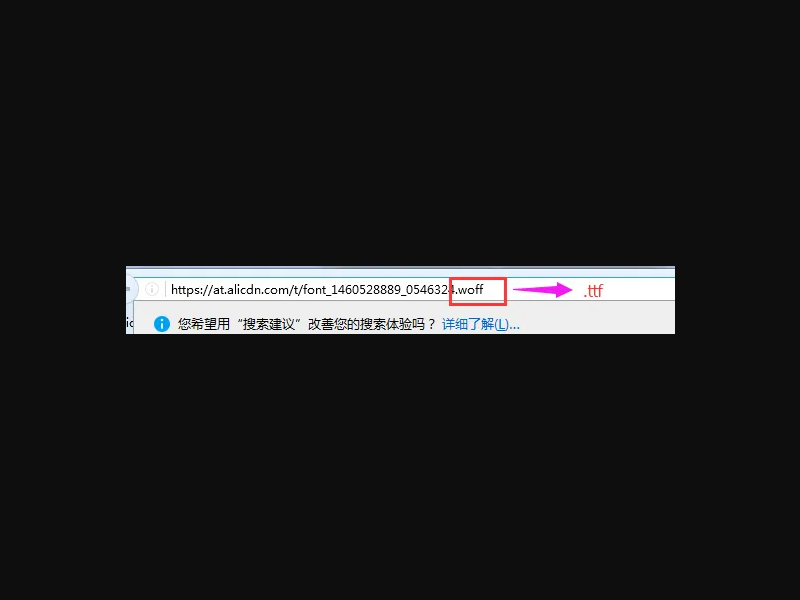

4. 保存到本地

  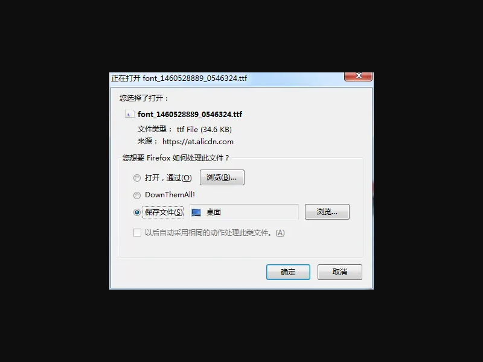

5. 为了兼容，一共要下载四个格式，分别是 **.woff**、**.ttf**、**.eot**、**.svg** ，只需把最后的格式改了，回车保存就好了


## 查看字体库的所有图标
> 既然是字体，肯定能用字体编辑软件查看，这里我推荐 [TypeTool](http://pan.baidu.com/s/1nv6aKlF "点击下载") ，来看使用方法：
 
 **先看安装：**

1. 下载 [TypeTool](http://pan.baidu.com/s/1nv6aKlF "点击下载") ，然后解压

  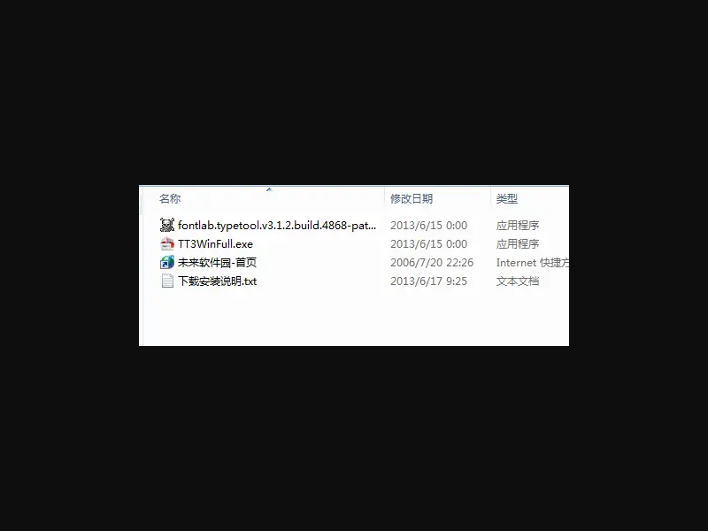

2. 先运行 **TT3WinFull.exe** 安装程序进行安装原版程序!

3. 安装完成后记得先不要运行程序！

4. 复制压缩包中的 **fontlab.typetool.v3.1.2.build.4868-patch.exe** 程序到安装目录！

5. 运行 **fontlab.typetool.v3.1.2.build.4868-patch.exe** ，点击 **Patch** 按钮对源程序打补丁即可。（切记，打补丁时一定要关闭软件，否则会失败的！）

6. 完成

#### 查看图标：
> 以刚才下载的天猫字体为例

1. 打开软件，打开字体文件

  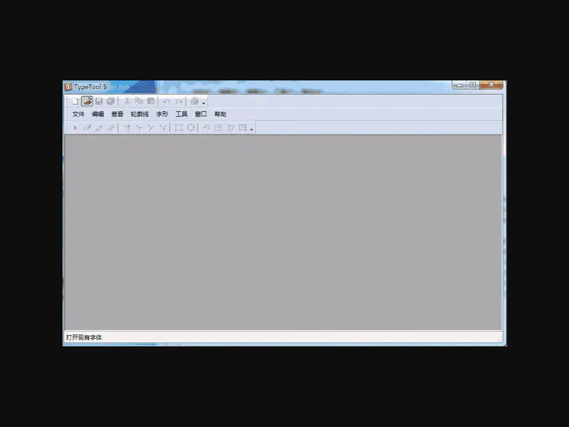

2. 打开之后可以看到所有的图标，选中某一个图标，可以看到图标对应的 **unicode码**

  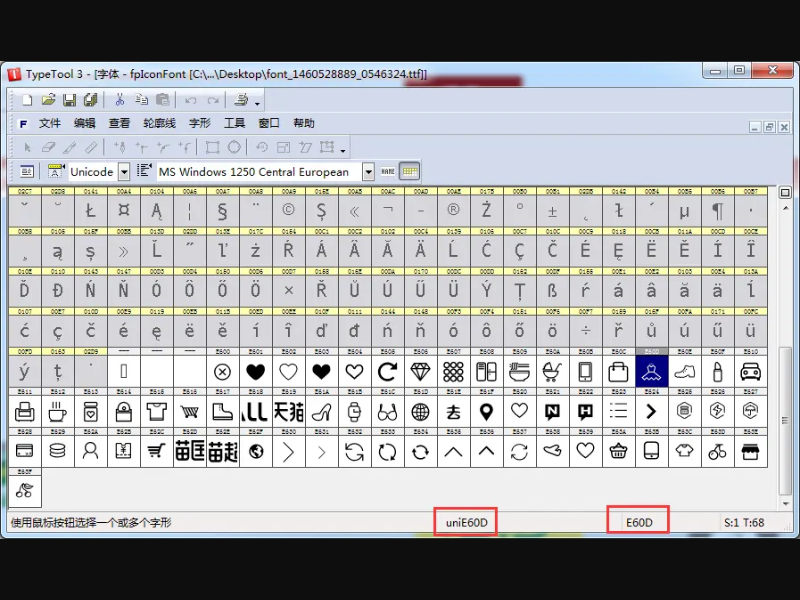

3. 把找到的 **e60d** 前面加 **&#x** 变为 **``````**，直接写在 **html** 里面就可以了

  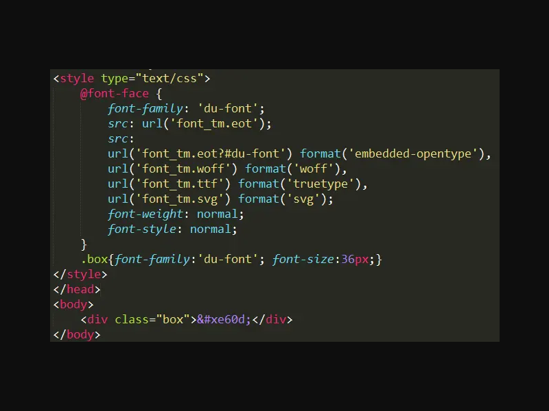
  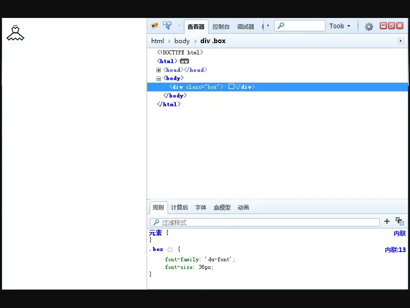

4. 是不是很简单？


_有不明白的可以留言☺_