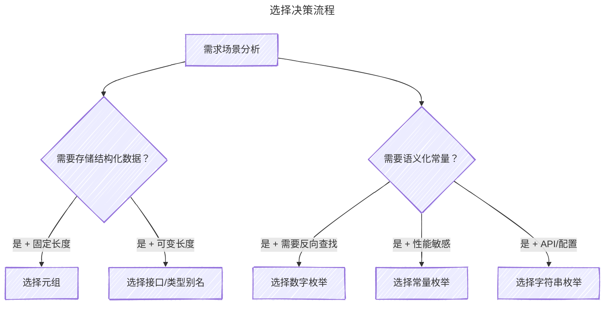

# 元组(Tuple)和枚举(Enum) {#tuples-enums}

`TypeScript`在`JavaScript`基础上新增了多种类型，其中元组(`Tuple`)和枚举(`Enum`)是两个非常实用且独特的类型。这两个类型在开发中有着广泛的应用场景，掌握它们对于编写高质量的`TypeScript`代码至关重要。

## 元组(Tuple) {#tuples}

元组是`TypeScript`特有的数组类型，它通过**类型+长度双约束**实现严格的数据结构控制。与普通数组不同，元组要求每个位置都有明确的类型，且长度固定不可变。

即：**固定类型+固定长度的数组**

```TypeScript
// 声明语法：[类型1, 类型2, ...类型N]
const teacherInfo: [string, string, number] = ["张三", "数学", 35];

// 类型不匹配会报错
teacherInfo[0] = 100; // ❌ Type 'number' is not assignable to type 'string'

// 长度越界会报错
teacherInfo.push("额外信息"); // ❌ 不能往元组中添加元素
```

元组的底层实现原理非常简单：`TypeScript`编译器会将元组编译为普通`JavaScript`数组，但在编译阶段进行严格的类型检查。这意味着运行时元组和普通数组没有区别，所有的类型安全都体现在开发阶段。

```JavaScript
// 编译后的JS代码（类型信息被擦除）
const teacherInfo = ["张三", "数学", 35];
```

### 实际应用场景 {#actual-usage}

#### 场景一：函数多返回值 {#scenario-1}

```TypeScript
/**
 * 执行数据库查询并返回结果统计
 * @returns [数据列表, 总数, 查询耗时(ms)]
 */
async function executeQueryWithStats<T>(
  queryBuilder: SelectQueryBuilder<T>
): Promise<[T[], number, number]> {
  const startTime = Date.now();
  const [data, total] = await queryBuilder.getManyAndCount();
  const duration = Date.now() - startTime;
  return [data, total, duration];
}

// 使用解构获取多个返回值
const [users, totalCount, queryTime] = await executeQueryWithStats(userQueryBuilder);
console.log(`查询完成：共${totalCount}条数据，耗时${queryTime}ms`);
```

#### 场景二：坐标与几何数据 {#scenario-2}

```TypeScript
type Point2D = [number, number];  // [经度, 纬度]
type Point3D = [number, number, number];  // [x, y, z]

function calculateDistance(point1: Point2D, point2: Point2D): number {
  const [x1, y1] = point1;
  const [x2, y2] = point2;
  return Math.sqrt(Math.pow(x2 - x1, 2) + Math.pow(y2 - y1, 2));
}
```

#### 场景三：React Hooks风格的状态管理 {#scenario-3}

```TypeScript
// 这种模式在NestJS的某些场景也适用，如配置管理
type ConfigState = [string, (value: string) => void];

function createConfigState(initialValue: string): ConfigState {
  let value = initialValue;
  const setValue = (newValue: string) => {
    value = newValue;
  };
  return [value, setValue];
}
```

### 高级特性 {#advanced-features}

#### 标签化元组（Labeled Tuple Elements） {#labeled-tuple-elements}

从`TypeScript 4.0`开始，元组支持为每个位置添加标签，大大提升了代码可读性：

```TypeScript
// 带标签的HTTP响应类型
type HttpResponse = [
  statusCode: number,
  message: string,
  data: unknown
];

// 使用时IDE会显示参数名称提示
const response: HttpResponse = [200, "Success", { id: 1 }];
```

#### 可选元素与剩余元素 {#optional-elements-rest-elements}

```TypeScript
// 可选元素（TS 3.0+）
type OptionalTuple = [string, number?];
const a: OptionalTuple = ["hello"];        // ✅ 第二个元素可选
const b: OptionalTuple = ["hello", 42];    // ✅

// 剩余元素
type StringNumberBooleans = [string, ...number[]];
const c: StringNumberBooleans = ["hello"];           // ✅
const d: StringNumberBooleans = ["hello", 1, 2, 3];  // ✅
```

#### 只读元组

使用`readonly`修饰符可以防止元组被修改：

```TypeScript
const readonlyTuple: readonly [string, number] = ["test", 123];
readonlyTuple[0] = "new"; // ❌ Error: Cannot assign to '0' because it is a read-only property
```
### 元组的防御性编程 {#defensive-programming}

虽然元组提供了编译时类型安全，但运行时仍可能通过类型断言绕过检查。以下是一些防御性编程技巧：

```TypeScript
// 类型保护函数
function isStudentTuple(obj: unknown): obj is [string, number] {
  return (
    Array.isArray(obj) &&
    obj.length === 2 &&
    typeof obj[0] === "string" &&
    typeof obj[1] === "number"
  );
}

// 安全的元组访问
function safeTupleAccess<T extends any[]>(
  tuple: T,
  index: number
): T[number] | undefined {
  if (index >= 0 && index < tuple.length) {
    return tuple[index];
  }
  return undefined;
}
```

## 枚举(Enum) {#enum}

枚举是`TypeScript`对`JavaScript`的重要扩展，用于定义一组命名常量。枚举的核心价值在于语义化——用有意义的名称替代魔法数字或字符串，提升代码可读性。

```TypeScript
// 基本枚举定义
enum Direction {
  Up,
  Down,
  Left,
  Right
}

// 使用枚举
const currentDirection = Direction.Up; // 值为0
```

枚举编译后会生成特殊的JavaScript对象，具有独特的双向映射特性（仅数字枚举）：

```JavaScript
// 编译结果
var Direction;
(function (Direction) {
    Direction[Direction["Up"] = 0] = "Up";
    Direction[Direction["Down"] = 1] = "Down";
    Direction[Direction["Left"] = 2] = "Left";
    Direction[Direction["Right"] = 3] = "Right";
})(Direction || (Direction = {}));

// 双向映射效果
console.log(Direction.Up);    // 0（正向）
console.log(Direction[0]);    // "Up"（反向）
```

### 枚举类型分类与对比 {#enum-type-comparison}

| 类型       | 示例                         | 编译结果                             | 反向映射 | 适用场景       |
|------------|------------------------------|--------------------------------------|----------|----------------|
| 数字枚举   | enum { Up, Down }            | `{0: "Up", 1: "Down", Up: 0, Down: 1}` | ✅        | 状态码、权限位  |
| 字符串枚举 | enum { Up = "UP" }           | `{Up: "UP"}`                           | ❌        | API类型、配置项 |
| 常量枚举   | const enum { Up }            | 完全内联                             | ❌        | 性能敏感场景   |
| 异构枚举   | enum { No = 0, Yes = "YES" } | 混合                                 | 部分     | ❌不推荐使用    |

```TypeScript
// 字符串枚举（推荐用于API相关场景）
enum HttpStatus {
  OK = "OK",
  Created = "CREATED",
  BadRequest = "BAD_REQUEST",
  Unauthorized = "UNAUTHORIZED",
  NotFound = "NOT_FOUND"
}

// 常量枚举（性能最优）
const enum LogLevel {
  Error = 0,
  Warn = 1,
  Info = 2,
  Debug = 3
}

// 编译后完全内联，不生成额外代码
console.log(LogLevel.Error); // 直接编译为 console.log(0)
```

### 实际应用场景 {#actual-application-scenarios}

#### 场景一：用户角色与权限管理 {#user-role-management}

```TypeScript
export enum UserRole {
  ADMIN = "ADMIN",
  MANAGER = "MANAGER",
  USER = "USER",
  GUEST = "GUEST"
}

// 使用位运算实现权限组合
export enum Permission {
  READ = 1 << 0,     // 1
  WRITE = 1 << 1,    // 2
  DELETE = 1 << 2,   // 4
  ADMIN = 1 << 3     // 8
}

// 权限检查
function hasPermission(userPermissions: number, required: Permission): boolean {
  return (userPermissions & required) === required;
}

// 组合权限
const editorPermissions = Permission.READ | Permission.WRITE; // 3
```

#### 场景二：API状态码管理 {#api-status-code-management}

```TypeScript
export enum ResponseCode {
  // 成功状态 2xx
  SUCCESS = 200,
  CREATED = 201,
  NO_CONTENT = 204,

  // 客户端错误 4xx
  BAD_REQUEST = 400,
  UNAUTHORIZED = 401,
  FORBIDDEN = 403,
  NOT_FOUND = 404,

  // 服务端错误 5xx
  INTERNAL_ERROR = 500,
  SERVICE_UNAVAILABLE = 503
}

// 在Controller中使用
@Controller('users')
export class UserController {
  @Get(':id')
  async findOne(@Param('id') id: string) {
    const user = await this.userService.findOne(id);
    if (!user) {
      throw new HttpException('User not found', ResponseCode.NOT_FOUND);
    }
    return user;
  }
}
```

#### 场景三：订单状态机 {#order-state-machine}

```TypeScript
export enum OrderStatus {
  PENDING = "PENDING",           // 待支付
  PAID = "PAID",                 // 已支付
  PROCESSING = "PROCESSING",     // 处理中
  SHIPPED = "SHIPPED",           // 已发货
  DELIVERED = "DELIVERED",       // 已送达
  CANCELLED = "CANCELLED",       // 已取消
  REFUNDED = "REFUNDED"          // 已退款
}

// 状态转换规则
const validTransitions: Record<OrderStatus, OrderStatus[]> = {
  [OrderStatus.PENDING]: [OrderStatus.PAID, OrderStatus.CANCELLED],
  [OrderStatus.PAID]: [OrderStatus.PROCESSING, OrderStatus.REFUNDED],
  [OrderStatus.PROCESSING]: [OrderStatus.SHIPPED, OrderStatus.CANCELLED],
  [OrderStatus.SHIPPED]: [OrderStatus.DELIVERED],
  [OrderStatus.DELIVERED]: [OrderStatus.REFUNDED],
  [OrderStatus.CANCELLED]: [],
  [OrderStatus.REFUNDED]: []
};
```

### 数组式访问与自定义索引 {#array-access-with-custom-index}

枚举可以像数组一样通过索引访问，也支持自定义起始索引值：

```TypeScript
// 默认从0开始
enum Gender {
  Male,    // 0
  Female   // 1
}

console.log(Gender.Male);     // 0
console.log(Gender[0]);       // "Male"（反向映射）
console.log(Gender[2]);       // undefined（越界访问）

// 自定义起始索引
enum Direction {
  Up = 100,    // 100
  Down,        // 101（自动递增）
  Left,        // 102
  Right        // 103
}

console.log(Direction.Up);      // 100
console.log(Direction[100]);    // "Up"
```

#### 实际应用：HTTP状态码映射 {#http-status-code-mapping}

```TypeScript
enum HttpStatus {
  OK = 200,
  Created = 201,
  Accepted = 202,
  BadRequest = 400,    // 新的起始点
  Unauthorized = 401,  // 自动递增
  Forbidden = 403,
  NotFound = 404
}
```

### 性能优化 {#performance-optimization}

#### 常量枚举的极致优化 {#constant-enum-optimization}

常量枚举会在编译阶段被完全内联替换，不生成任何运行时代码：

```TypeScript
// 使用常量枚举
const enum HttpMethod {
  GET = "GET",
  POST = "POST",
  PUT = "PUT",
  DELETE = "DELETE"
}

// 编译前
const method = HttpMethod.GET;

// 编译后（完全内联）
const method = "GET";
```

#### Tree-Shaking优化配置 {#tree-shaking-optimization}

对于字符串枚举，可以配置构建工具进行Tree-Shaking：

```TypeScript
export default {
  build: {
    rollupOptions: {
      treeshake: {
        enumExports: true  // 移除未使用的枚举值
      }
    }
  }
};

```

## 元组 vs 枚举 {#tuple-vs-enum}

### 核心差异对比 {#core-differences-comparison}

| 特性     | 元组                   | 枚举                     |
| -------- | ---------------------- | ------------------------ |
| 主要用途 | 固定结构的数据容器     | 命名常量集合             |
| 类型安全 | ⭐⭐⭐⭐⭐ 编译时严格检查   | ⭐⭐⭐⭐ 运行时可能undefined |
| IDE支持  | ⭐⭐⭐ 基础补全           | ⭐⭐⭐⭐⭐ 智能提示枚举值     |
| 序列化   | ⭐⭐⭐⭐ JSON自动转换      | ⭐⭐⭐ 需自定义序列化       |
| 内存占用 | 较小（12-16字节/元素） | 较大（20-24字节/成员）   |
| 反向映射 | ❌ 不支持               | ✅ 数字枚举支持           |

### 选择决策流程 {#decision-making-process}



### 误用案例 {#misusing-cases}

#### 误用1：用元组表示状态 {#misusing-tuple-for-state}

```TypeScript
// ❌ 反例：用元组表示状态机（不直观）
type State = [boolean, boolean]; // [isLoading, isError]

// ✅ 正解：应使用枚举
enum LoadState {
  Idle = "IDLE",
  Loading = "LOADING",
  Success = "SUCCESS",
  Error = "ERROR"
}
```

#### 误用2：用枚举存储坐标 {#misusing-enum-for-coordinates}

```TypeScript
// ❌ 反例：用枚举存储坐标（语义不清）
enum Position { X = 100, Y = 200 }

// ✅ 正解：应使用元组
type Position = [number, number];
const pos: Position = [100, 200];
```