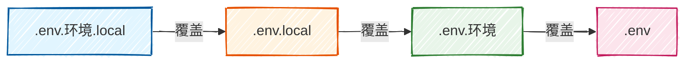

# dotenv-flow {#dotenv-flow-title}

`dotenv-flow` 是一个基于 `dotenv` 的环境变量管理工具，它可以在不同的操作系统上使用相同的环境变量。

## 与 dotenv 的区别 {#with-dotenv-difference}

| 功能         | 原生dotenv               | dotenv-flow（增强版）               |
| ------------ | ------------------------ | ----------------------------------- |
| 多环境支持   | 不支持，只能手动切换文件 | 原生支持开发/测试/生产自动切换      |
| 配置优先级   | 无，单个文件覆盖         | 规范的多级优先级，兼容团队+本地配置 |
| 本地私有配置 | 需要手动处理             | 原生支持 .local 文件，绝不提交Git   |
| 变量复用     | 不支持                   | 原生支持变量嵌套引用                |
| 企业适配性   | 仅适合本地小项目         | 行业标准，生产环境通用              |

## 解决什么痛点 {#what-problems}

`dotenv` 只能加载一个 `.env` 文件, 这导致了以下痛点:

- 开发环境、生产环境配置要手动改文件
- 容易把开发配置误带到线上
- 本地私有配置无法区分

`dotenv-flow` 自动按环境加载配置：

- `.env`：默认加载，所有环境都使用
- `.env.development`：开发环境使用
- `.env.test`：测试环境使用
- `.env.production`：生产环境使用
- `.env.local`：本地开发环境使用，绝不提交Git

## 安装 {#install}

```bash
npm install dotenv-flow
```

## 必须创建的文件（固定规则） {#required-files}

```plaintext
.env                      # 全局基础默认配置（所有环境共用，可提交Git）
.env.development          # 开发环境专属配置（可提交Git）
.env.production           # 生产环境专属配置（可提交Git）
.env.test                 # 单元测试环境专属配置（可提交Git）
.env.local                # 本地个人私有配置（绝不提交Git，优先级最高）
.env.development.local    # 开发环境本地私有配置（绝不提交Git）
```

### 优先级 {#priority-order}



## 使用 {#use}

### 配置 {#config}

::: code-group

```ini [.env 基础配置]
APP_NAME=myapp
PORT=3000
```

```ini [.env.development 开发环境]
NODE_ENV=development
API_URL=http://localhost:8080
DEBUG=true
```

```ini [.env.production 生产环境]
NODE_ENV=production
API_URL=https://api.yourapp.com
DEBUG=false
```

:::

### 读取 {#read}


::: code-group


```javascript [ES 模块（import/export）]
import dotenvFlow from 'dotenv-flow';
dotenvFlow.config();

console.log('环境：', process.env.NODE_ENV);
console.log('端口：', process.env.PORT);
console.log('API：', process.env.API_URL);
```

```javascript [CommonJS 模块（require）]
const dotenvFlow = require('dotenv-flow');
dotenvFlow.config();

console.log('环境：', process.env.NODE_ENV);
console.log('端口：', process.env.PORT);
console.log('API：', process.env.API_URL);
```

:::

## 切换环境 {#switch-environment}

配合 `cross-env` 切换环境。

```json [package.json]
{
  "name": "demo",
  "scripts": {
    "dev": "cross-env NODE_ENV=dev PORT=3000 node app.js",
    "prod": "cross-env NODE_ENV=prod PORT=80 node app.js"
  },
  "devDependencies": {
    "cross-env": "^7.0.3"
  }
}
```

## 自定义文件路径 {#custom-file-path}

你可以自定义环境变量文件的路径。默认路径为 `./.env`。

```javascript [app.js]
dotenvFlow.config({
  path: './config/.env'
});
```

## .gitignore {#gitignore}

永远不要提交本地配置文件到 Git 仓库。

```plaintext
# local env files
.env.local
.env.*.local
```