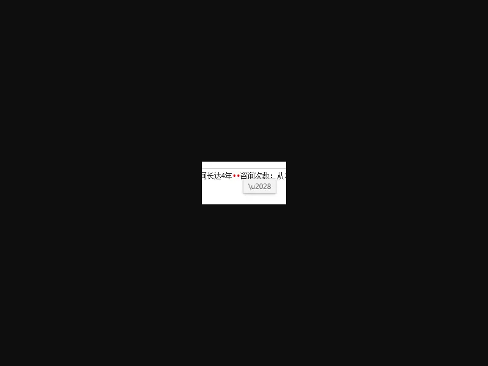
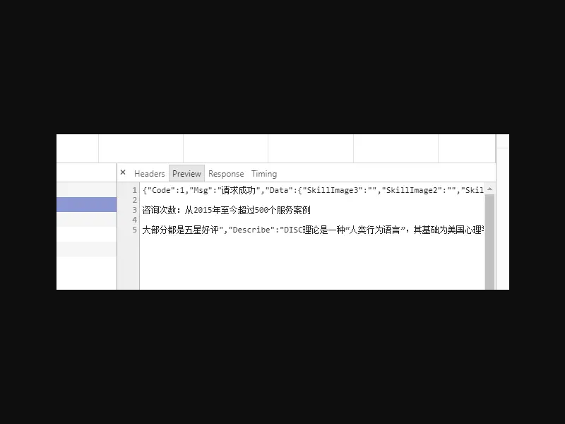

# 小程序爬坑

### 解密 [getUserInfo](https://developers.weixin.qq.com/miniprogram/dev/api/open-api/user-info/wx.getUserInfo.html) 敏感信息 {#解密getUserInfo敏感信息}
  需要先 ```wx.login()``` ，再 ```wx.getUserInfo()```
  [@讲个笑话遗忘](https://www.jianshu.com/u/c162292f6402) ： ```sessionKey``` 存在于 ```redis``` 缓存，登录会刷新缓存，顺序颠倒可能会解密失败


### 防盗链处理 {#防盗链处理}
  资源做了防盗链，需要把小程序的域名：```servicewechat.com``` 添加到白名单
  来源：[小程序如何设置资源的防盗链 — 随笔小记](https://juejin.im/post/5bff28bc518825689f1b3b70)


### [mpvue](https://github.com/Meituan-Dianping/mpvue) 使用 [mpvue-wxparse](https://github.com/F-loat/mpvue-wxParse)  {#mpvue使用mpvue-wxparse}
  ```mpvue-wxparse``` 是解析富文本内容的库
  当前```(2018年12月27日)``` 没有 ES6 转 ES5，需要主动转 ES5，在 ```/build/webpack.base.conf.js``` 里加rules：
  ```jaavascript
  {
	  test: /\.js$/, 
	  include: [resolve('src'), resolve('test'), /mpvue-wxparse/],
	  use: [ 
		  'babel-loader', 
		  { 
			  loader: 'mpvue-loader', 
			  options: { 
				  checkMPEntry: true
			  } 
		  }, 
	  ] 
  },
  ```
  解决来源: [mpvue项目在iOS9上面报如下截图错图 #1036](https://github.com/Meituan-Dianping/mpvue/issues/1036)


### 使用 [dayjs](https://github.com/iamkun/dayjs) 获取相对时间需要注意的坑  {#使用dayjs获取相对时间需要注意的坑}
  获取相对时间需要用到 ``` dayjs ``` 的插件 [RelativeTime](https://github.com/iamkun/dayjs/blob/master/docs/zh-cn/Plugin.md#relativetime)
  ```javascript
  const time = '2018-12-28 15:39';
  const str = dayjs().locale('zh-cn').to(time);
  console.log(str);    // 6 天前, ios: NaN 年前
  ```
  时间必须是完整的，比如 ``` 2018-12-28 15:39:12 ``` ，如果是 ``` 2018-12-28 15:39 ``` 这样缺少秒的 ```ios``` 会报错


### ```/u2028```行分隔符，导致响应 json 异常  {#u2028行分隔符导致响应json异常}
在开发者工具无异常，可正常解析，但是真机解析异常，如图



解决方法：
  + 后端处理：
      在响应的时候替换掉 ```/u2028```
  + 前端处理：
      请求的 ```dataType``` 设为 ```text```，然后替换掉 ```/u2028```再转为 JSON


### APP分享小程序 ```200300``` 错误  {#app分享小程序200300错误}
有可能是图片太大，小程序封面图片需小于128k