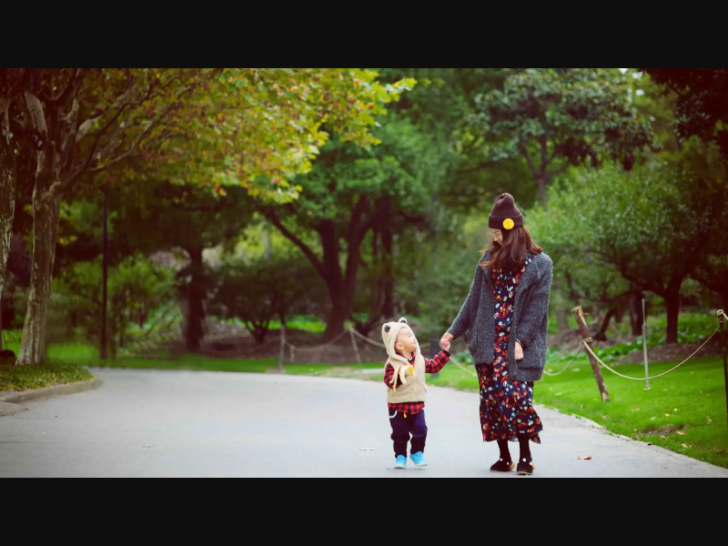
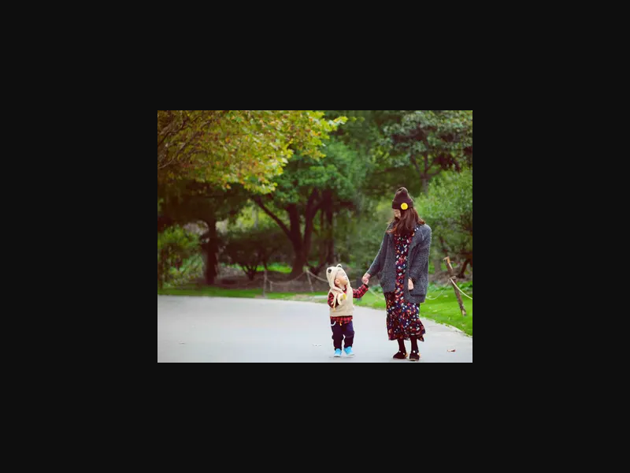
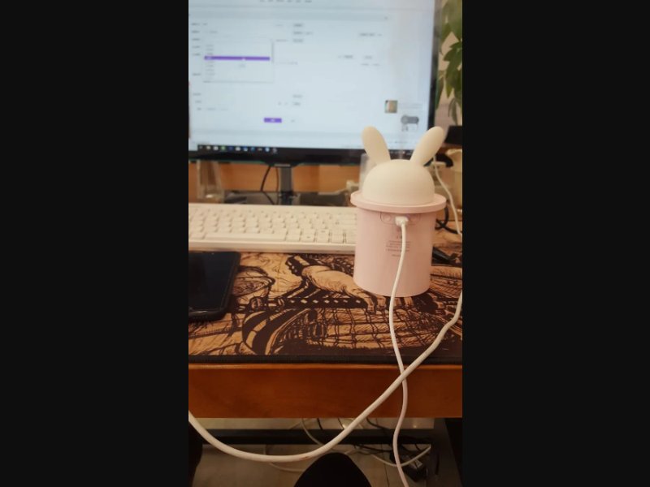
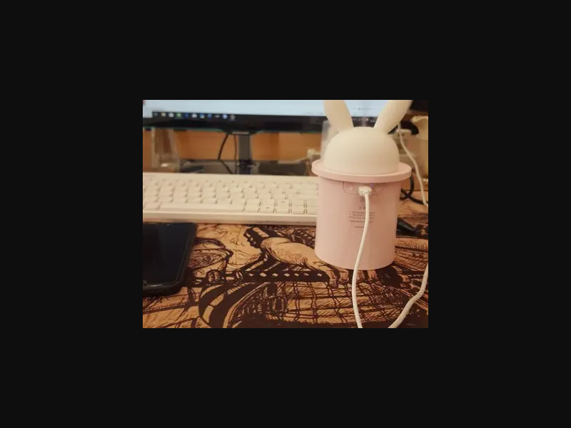

# 小程序封面-七牛图片裁剪 {#小程序封面-七牛图片裁剪}

## 概述 {#概述}

在小程序开发中，经常需要处理图片裁剪以符合特定尺寸要求。本文介绍如何使用七牛云的图片处理API实现小程序封面的裁剪，包括尺寸调整、格式转换和质量控制等功能。

## 七牛API介绍 {#七牛API介绍}

使用七牛的 [图片高级处理(imageMogr2)](https://developer.qiniu.com/dora/manual/1270/the-advanced-treatment-of-images-imagemogr2) 接口实现图片裁剪功能。

## imageMogr2参数详解 {#imageMogr2参数详解}

| 参数 | 说明 | 
|------|------| 
| `auto-orient` | 建议放在首位，根据原图EXIF信息自动旋正，便于后续处理。 | 
| `thumbnail` | 缩放，参看[缩放操作参数表](https://developer.qiniu.com/dora/manual/1270/the-advanced-treatment-of-images-imagemogr2#imagemogr2-thumbnail-spec)，默认为不缩放。| 
| `gravity` | 裁剪偏移，参看[图片处理重心参数表](https://developer.qiniu.com/dora/manual/1270/the-advanced-treatment-of-images-imagemogr2#imagemogr2-anchor-spec)，目前在imageMogr2中只影响其后的裁剪偏移参数，默认为左上角(NorthWest)。| 
| `crop` | 裁剪，参看[裁剪操作参数表](https://developer.qiniu.com/dora/manual/1270/the-advanced-treatment-of-images-imagemogr2#imagemogr2-crop-size-spec)，默认为不裁剪。 | 
| `format` | 图片格式。支持jpg、gif、png、webp等，默认为原图格式，参看[支持转换的图片格式](http://www.imagemagick.org/script/formats.php)。| 
| `quality` | 新图的图片质量。取值范围为1-100，默认75。指定值后面可以增加 `!`，表示强制使用指定值，如：`100!`。支持图片类型：jpg。| 
| `size-limit` | 限制图片转换后的大小，支持以兆字节和千字节为单位的图片。~~对于所有图片格式，若在尾部加上`!`，表示用转换后的图片大小与原图大小做比较，如果转换后的图片比原图小，则返回转换后的图片，否则返回原图。~~<br>**注：如果加了感叹号，小于指定大小的图会返回原图，导致裁剪失败** | 

## 基础实现 {#基础实现}

### 需求分析 {#需求分析}

小程序需要 `5:4` 的封面图，且图片不能大于 `128k`，而原始封面图都是 `16:9` 的比例。

### 实现代码 {#实现代码}

```text
?imageMogr2/auto-orient/thumbnail/x320/gravity/Center/crop/400x320/format/jpg/quality/100/size-limit/120k
```

### 参数说明 {#参数说明}

| 参数 | 说明 |
|------|------|
| `/thumbnail/x320` | 指定高度为320，宽度自适应 |
| `/gravity/Center` | 后续裁剪居中裁剪 |
| `/crop/400x320` | 裁剪大小400x320(5:4) |
| `/format/jpg` | 图片格式取jpg |
| `/quality/100` | 图片质量100%，不然有可能会模糊 |
| ~~`size-limit/120k!`~~ | ~~限制图片转换后的最大为120k~~ <span class="delete-date">2019-04-01 删除</span> |
| `size-limit/120k` | 限制图片转换后的最大为120k <span class="add-date">2019-04-01 添加</span> |

### 效果展示 {#效果展示}

转换前：


转换后：


## 优化方案 {#优化方案}

### 初始方案局限性 {#初始方案局限性}

因为我们的比例为 `16:9`，所以只是限制了高度。如果比例不是宽比高大，那么需要去限制宽，其他的需求需要参考文档去实现。

### 通用方案 {#通用方案}

为了解决不同的宽高比问题，查看文档之后发现了 [`/thumbnail/!<Width>x<Height>r`](https://developer.qiniu.com/dora/manual/1270/the-advanced-treatment-of-images-imagemogr2#imagemogr2-thumbnail-spec)，只需改变 `thumbnail` 属性值为 `!400x320r` 就可以了。

#### 实现代码 {#实现代码-通用方案}

```text
?imageMogr2/auto-orient/thumbnail/!400x320r/gravity/Center/crop/400x320/format/jpg/quality/100/size-limit/120k
```

#### 参数说明 {#参数说明-通用方案}

| 参数 | 说明 |
|------|------|
| `/thumbnail/!400x320r` | 按照`400x320(5:4)`等比缩放，比例值为宽缩放比和高缩放比的较大值 |

#### 效果展示 {#效果展示-通用方案}

转换前：


转换后：


## 问题修复 {#问题修复}

### 问题描述 {#问题描述}

发现一个`192*192`大小的图没有放大到`400*320`，经检查发现是`size-limit/120k!`导致。

### 问题原因 {#问题原因}

查看七牛文档发现：

> 对于所有图片格式，若在尾部加上!，表示用转换后的图片大小与原图大小做比较，如果转换后的图片比原图小，则返回转换后的图片，否则返回原图。

如果图片原大小小于`120k`，会直接返回原图，之前的所有指令都失效，导致裁剪失败。

### 解决方案 {#解决方案}

直接去掉 `size-limit` 参数末尾的 `!` 即可。

::: warning
注意：`size-limit` 参数末尾的 `!` 会导致小图不进行裁剪，直接返回原图。如果需要确保所有图片都按照指定尺寸处理，请移除 `!` 符号。
:::


  