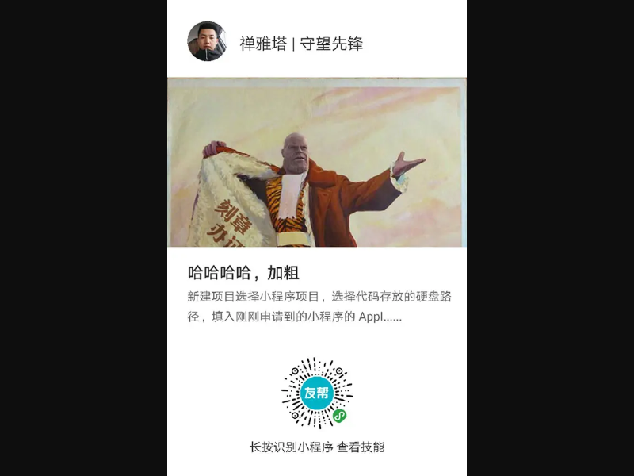
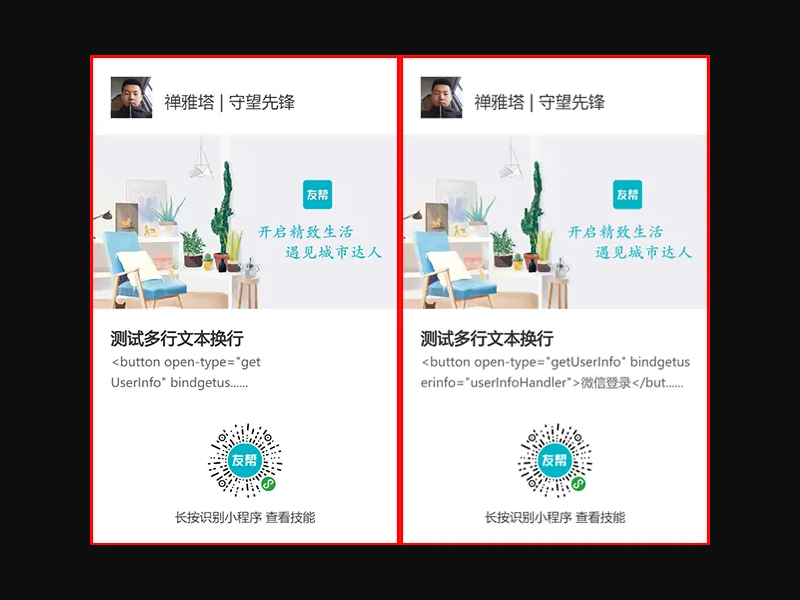

# 小程序canvas文本绘制自动换行、字体加粗简单实现

## 概述 {#概述}

在小程序开发中，canvas文本绘制是一个常见需求，但官方API并未直接提供文本自动换行和字体加粗的功能。本文将介绍如何通过简单实现来解决这两个问题，并提供优化方案以处理英文文本的精确换行。

## 基础实现 {#基础实现}

### 1. 文本绘制与加粗 {#文本绘制与加粗}

首先，我们实现一个基础的文本绘制函数，支持字体加粗效果：

```javascript
/**
 * 渲染文字
 * @param {Object} obj - 文本配置对象
 */
drawText: function (obj) {
    console.log('渲染文字');
    this.ctx.save();
    this.ctx.setFillStyle(obj.color);
    this.ctx.setFontSize(obj.size);
    this.ctx.setTextAlign(obj.align);
    this.ctx.setTextBaseline(obj.baseline);
    
    // 字体加粗处理：通过多次偏移绘制实现加粗效果
    if (obj.bold) {
        console.log('字体加粗');
        // 在四个方向偏移0.5像素绘制，实现加粗效果
        this.ctx.fillText(obj.text, obj.x, obj.y - 0.5);
        this.ctx.fillText(obj.text, obj.x - 0.5, obj.y);
    }
    
    // 正常绘制文本
    this.ctx.fillText(obj.text, obj.x, obj.y);
    
    if (obj.bold) {
        // 继续在另外两个方向偏移绘制
        this.ctx.fillText(obj.text, obj.x, obj.y + 0.5);
        this.ctx.fillText(obj.text, obj.x + 0.5, obj.y);
    }
    
    this.ctx.restore();
},
```

::: tip
加粗原理：通过在文本的四个方向（上、下、左、右）各偏移0.5像素进行多次绘制，形成视觉上的加粗效果。这种方法兼容性较好，但可能会影响性能。
:::

### 2. 文本自动换行 {#文本自动换行}

接下来，我们实现一个简单的文本自动换行函数：

```javascript
/**
 * 文本换行（简单实现）
 * @param {Object} obj - 文本配置对象
 */
textWrap: function (obj) {
    console.log('文本换行');
    // 计算每行可容纳的字符数（基于字符宽度估算）
    var td = Math.ceil(obj.width / (obj.size));
    // 计算总行数
    var tr = Math.ceil(obj.text.length / td);
    
    // 逐行绘制文本
    for (var i = 0; i < tr; i++) {
        var txt = {
            x: obj.x,
            y: obj.y + (i * obj.height),
            color: obj.color,
            size: obj.size,
            align: obj.align,
            baseline: obj.baseline,
            text: obj.text.substring(i * td, (i + 1) * td),
            bold: obj.bold
        };
        
        // 只绘制指定行数内的文本
        if (i < obj.line) {
            // 最后一行添加省略号
            if (i == obj.line - 1) {
                txt.text = txt.text.substring(0, txt.text.length - 3) + '......';
            }
            this.drawText(txt);
        }
    }
},
```

::: warning
这种简单实现方式对于纯中文文本效果较好，但对于包含英文的文本，由于字符宽度不一致，会导致换行位置不准确。下一节将提供优化方案。
:::

## 参数说明 {#参数说明}

### drawText 方法参数 {#drawText-方法参数}

```javascript
let title = {
    x: 40,
    y: 524,
    color: '#333333',
    size: 32,
    align: 'left',
    baseline: 'top',
    text: '哈哈哈哈，加粗',
    bold: true
};
this.drawText(title);
```

| 参数 | 类型 | 说明 | 
|------|------|------| 
| [x](https://developers.weixin.qq.com/miniprogram/dev/api/canvas/fill-text.html) | Number | 绘制文本的左上角x坐标位置 | 
| [y](https://developers.weixin.qq.com/miniprogram/dev/api/canvas/fill-text.html) | Number | 绘制文本的左上角y坐标位置 | 
| [color](https://developers.weixin.qq.com/miniprogram/dev/api/canvas/set-fill-style.html) | Color | 字体的颜色 | 
| [size](https://developers.weixin.qq.com/miniprogram/dev/api/canvas/set-font-size.html) | Number | 字体的字号 | 
| [align](https://developers.weixin.qq.com/miniprogram/dev/api/canvas/set-text-align.html) | String | 文字的对齐，可选值 'left'、'center'、'right' | 
| [baseline](https://developers.weixin.qq.com/miniprogram/dev/api/canvas/set-text-baseline.html) | String | 设置文字的水平对齐，可选值 'top'、'bottom'、'middle'、'normal' | 
| [text](https://developers.weixin.qq.com/miniprogram/dev/api/canvas/fill-text.html) | String | 在画布上绘制被填充的文本 | 
| bold | Boolean | 是否加粗 | 

### textWrap 方法参数 {#textWrap-方法参数}

```javascript
let details = {
    x: 40,
    y: 576,
    width: 520,
    height: 40,
    line: 2,
    color: '#666666',
    size: 24,
    align: 'left',
    baseline: 'top',
    text: '新建项目选择小程序项目，选择代码存放的硬盘路径，填入刚刚申请到的小程序的 AppID，给你的项目起一个好听的名字。',
    bold: false
}
this.textWrap(details);  // 注意：这里应该是textWrap而不是drawText
```

| 参数 | 类型 | 说明 | 
|------|------|------| 
| [x](https://developers.weixin.qq.com/miniprogram/dev/api/canvas/fill-text.html) | Number | 绘制文本的左上角x坐标位置 | 
| [y](https://developers.weixin.qq.com/miniprogram/dev/api/canvas/fill-text.html) | Number | 绘制文本的左上角y坐标位置 | 
| width | Number | 文本区域宽度 | 
| height | Number | 文本行高 | 
| line | Number | 最多显示几行 | 
| [color](https://developers.weixin.qq.com/miniprogram/dev/api/canvas/set-fill-style.html) | Color | 字体的颜色 | 
| [size](https://developers.weixin.qq.com/miniprogram/dev/api/canvas/set-font-size.html) | Number | 字体的字号 | 
| [align](https://developers.weixin.qq.com/miniprogram/dev/api/canvas/set-text-align.html) | String | 文字的对齐，可选值 'left'、'center'、'right' | 
| [baseline](https://developers.weixin.qq.com/miniprogram/dev/api/canvas/set-text-baseline.html) | String | 设置文字的水平对齐，可选值 'top'、'bottom'、'middle'、'normal' | 
| [text](https://developers.weixin.qq.com/miniprogram/dev/api/canvas/fill-text.html) | String | 在画布上绘制被填充的文本 | 
| bold | Boolean | 是否加粗 | 

## 基础实现效果 {#基础实现效果}



## 优化方案 {#优化方案}

### 问题分析 {#问题分析}

上述简单实现对于纯中文文本效果较好，但如果文本中包含英文字符，由于中英文字符宽度不一致，会导致换行位置计算不准确。为了解决这个问题，我们需要使用更精确的文本宽度计算方法。

### 优化实现 {#优化实现}

#### 1. 精确计算文本换行位置 {#精确计算文本换行位置}

优化原理：通过基础库 1.9.90 开始支持的[measureText](https://developers.weixin.qq.com/miniprogram/dev/api/canvas/measure-text.html)接口返回的文本宽度，把每个字符宽度不断累加，精确计算在哪个位置应该换行。

```javascript
/**
 * 获取文本折行（精确计算）
 * @param {Object} obj - 文本配置对象
 * @return {Array} arrTr - 折行后的文本数组
 */
getTextLine: function(obj){
    // 设置字体大小以获取准确的文本宽度
    this.ctx.setFontSize(obj.size);
    
    // 将文本拆分为单个字符
    let arrText = obj.text.split('');
    let line = '';
    let arrTr = [];
    
    // 逐个字符计算宽度
    for (let i = 0; i < arrText.length; i++) {
        var testLine = line + arrText[i];
        // 测量当前行的宽度
        var metrics = this.ctx.measureText(testLine);
        var width = metrics.width;
        
        // 如果当前行宽度超过限制，且不是第一个字符
        if (width > obj.width && i > 0) {
            // 将当前行保存到结果数组
            arrTr.push(line);
            // 从新字符开始下一行
            line = arrText[i];
        } else {
            // 继续添加字符到当前行
            line = testLine;
        }
        
        // 处理最后一个字符
        if (i == arrText.length - 1) {
            arrTr.push(line);
        }
    }
    
    return arrTr;
},
```

| 参数 | 类型 | 说明 | 
|------|------|------| 
| width | Number | 文本区域宽度 | 
| [size](https://developers.weixin.qq.com/miniprogram/dev/api/canvas/set-font-size.html) | Number | 字体的字号 | 
| [text](https://developers.weixin.qq.com/miniprogram/dev/api/canvas/fill-text.html) | String | 在画布上绘制被填充的文本 | 

#### 2. 更新文本换行方法 {#更新文本换行方法}

使用精确计算后的文本换行方法：

```javascript
/**
 * 文本换行（优化版）
 * @param {Object} obj - 文本配置对象
 */
textWrap: function (obj) {
    console.log('文本换行');
    // 使用精确计算获取折行文本
    let tr = this.getTextLine(obj);
    
    // 逐行绘制文本
    for (let i = 0; i < tr.length; i++) {
        // 只绘制指定行数内的文本
        if (i < obj.line) {
            let txt = {
                x: obj.x,
                y: obj.y + (i * obj.height),
                color: obj.color,
                size: obj.size,
                align: obj.align,
                baseline: obj.baseline,
                text: tr[i],
                bold: obj.bold
            };
            
            // 最后一行添加省略号
            if (i == obj.line - 1) {
                txt.text = txt.text.substring(0, txt.text.length - 3) + '......';
            }
            
            this.drawText(txt);
        }
    }
},
```

## 优化效果 {#优化效果}

### 包含英文字母的文本效果 {#包含英文字母的文本效果}


::: warning
注：在开发工具中截取圆形会失效，这张是开发者工具生成的，第一张是真机生成的。
:::

### 优化前后对比 {#优化前后对比}



从对比图可以看出，优化后的实现能够更准确地处理包含英文字符的文本换行，避免了字符被截断或换行位置不准确的问题。

## 补充：字体加粗的另一种实现 {#补充字体加粗的另一种实现}

基础库 1.9.90 开始支持设置字体样式 [canvasContext.font](https://developers.weixin.qq.com/miniprogram/dev/api/canvas/font.html)，可以直接使用该属性实现字体加粗：

```javascript
canvasContext.font = value
```

#### value 支持的属性有：

| 属性 | 说明 |
|------|------|
| style | 字体样式。仅支持 italic, oblique, normal |
| weight | 字体粗细。仅支持 normal, bold |
| size | 字体大小 |
| family | 字体族名。注意确认各平台所支持的字体 |

使用示例：

```javascript
this.ctx.font = 'bold 14px sans-serif';
this.ctx.fillText('加粗文本', x, y);
```

::: tip
如果不需要兼容低版本基础库，直接使用 `font` 属性是更好的选择，性能更好且代码更简洁。如果需要兼容低版本库，则使用前面介绍的重复渲染方式。
:::

## 总结 {#总结}

本文介绍了在小程序canvas中实现文本自动换行和字体加粗的两种方法：

1. **基础实现**：通过字符数估算实现简单换行，通过多次偏移绘制实现加粗效果，兼容性好但精度有限。
2. **优化实现**：使用 `measureText` API 精确计算文本宽度，实现准确的换行效果；使用 `font` 属性直接设置字体粗细。

这些方法解决了小程序canvas中文本处理的基本需求，但仍有一些局限性：

- 性能问题：多次渲染实现加粗会影响性能
- 兼容性问题：新API需要较高版本的基础库
- 功能限制：不支持更复杂的文本排版需求


---
> 优化待续...

